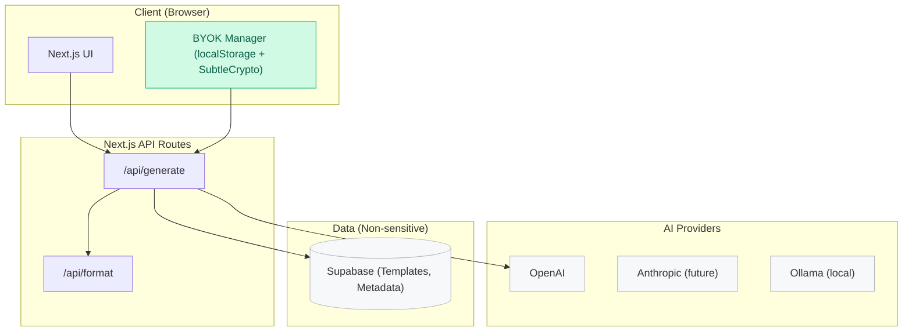

# Harvest.ai Architecture Overview

## Mermaid Diagram



## ASCII Sketch

```
+-------------------+         +------------------------+
|  Client (Browser) |         |   Next.js API Routes   |
|  - UI             |  HTTP   |  /api/generate         |
|  - BYOK Manager   +-------->+  /api/format           |
|  (localStorage)   |         |                        |
+-------------------+         +------------------------+
                                      |
                                      | Using user's API key (BYOK)
                                      v
                              +------------------+
                              |   OpenAI (API)   |
                              +------------------+
                                      |
                                      | Non-sensitive metadata only
                                      v
                              +------------------------+
                              |    Supabase (DB)       |
                              | Templates / Metadata   |
                              +------------------------+
```

## Security Notes
- Zero-knowledge BYOK: Keys live in browser; never persisted server-side.
- Disable logging for requests containing keys; scrub middleware where needed.
- Session-only handling for inputs/outputs; no user content persistence.
- Prefer direct provider calls from edge when feasible.

## Data Flow
1. User provides content + selects format in UI.
2. UI includes BYOK key in the request to `/api/generate`.
3. API proxies to OpenAI using the user key; returns result.
4. Non-sensitive metadata stored in Supabase for analytics (optional).
