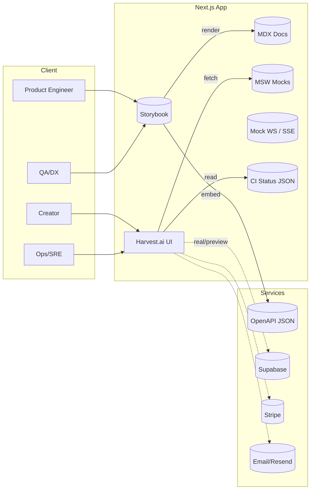
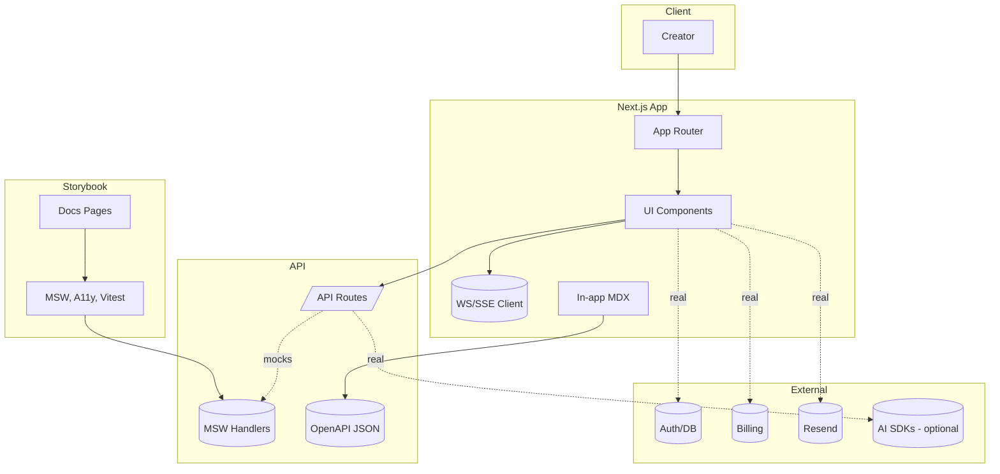

import * as React from "react";
import { Meta } from "@storybook/addon-docs";
import LastUpdated from "./components/LastUpdated";
import InlineToc from "./components/InlineToc";

export const parameters = {
  repoDocPath: "/docs/architecture/SYSTEM_ARCHITECTURE.md",
  repoDocLabel: "System Architecture",
};

# Architecture — System Map & Dependencies; Layered View; Data Model — Extended ERD

<a id="top"></a>

<Meta title="Overview/Architecture — System Map & Dependencies; Layered View; Data Model — Extended ERD" />

This page collects the core architecture diagrams for Harvest.ai: the high-level system map, a layered dependency view, and an extended ERD for key domains.

## On this page

<InlineToc
  items={[
    { href: "#system-map-context", label: "System map (context)" },
    { href: "#layered-service-dependencies", label: "Layered service dependencies" },
    { href: "#data-model-extended-erd", label: "Data model — Extended ERD" },
  ]}
/>

## System map (context)

<div style={{ textAlign: "right" }}>
  <a href="#top">Back to top</a>
</div>



## Layered service dependencies

<div style={{ textAlign: "right" }}>
  <a href="#top">Back to top</a>
</div>



## Data model — Extended ERD

<div style={{ textAlign: "right" }}>
  <a href="#top">Back to top</a>
</div>

<LastUpdated file="src/stories/Architecture.stories.mdx" />

```mermaid path=null start=null
erDiagram
  ORGANIZATION ||--o{ MEMBERSHIP : has
  USER ||--o{ MEMBERSHIP : joins
  USER ||--o{ CONTENT_DRAFT : authors
  CONTENT_DRAFT ||--o{ GENERATION_RUN : produces
  TEMPLATE ||--o{ CONTENT_DRAFT : applies
  ORGANIZATION ||--o{ API_KEY : issues
  USER ||--o{ API_KEY : creates
  USER ||--o{ AUDIT_EVENT : triggers
  CONTENT_DRAFT ||--o{ AUDIT_EVENT : context
  EPIC ||--o{ STATUS_ARTIFACT : references
  INCIDENT ||--o{ STATUS_ARTIFACT : records

  ORGANIZATION {
    string id
    string name
    string tier // free, pro, team, enterprise
    datetime createdAt
  }
  MEMBERSHIP {
    string id
    string orgId
    string userId
    string role // owner, admin, member
  }
  USER {
    string id
    string email
    string role
  }
  CONTENT_DRAFT {
    string id
    string title
    text body
    string format
    datetime createdAt
  }
  GENERATION_RUN {
    string id
    string draftId
    string model
    float temperature
    string status
    datetime startedAt
    datetime finishedAt
  }
  TEMPLATE {
    string id
    string name
    string format
  }
  API_KEY {
    string id
    string orgId
    string userId
    string name
    datetime createdAt
    datetime lastUsedAt
    boolean active
  }
  AUDIT_EVENT {
    string id
    string userId
    string orgId
    string type // generate, export, incident_open, login
    string ip
    string userAgent
    datetime createdAt
  }
  STATUS_ARTIFACT {
    string id
    string type  // coverage, e2e, storybook
    string url
    datetime generatedAt
  }
```
