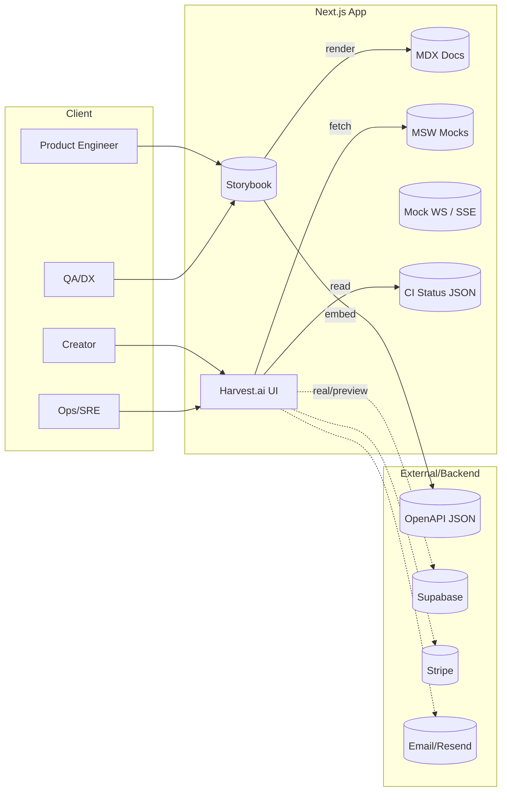
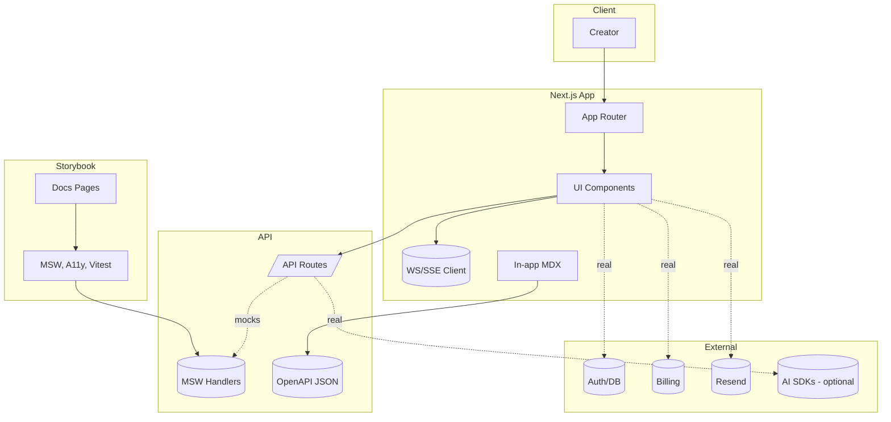
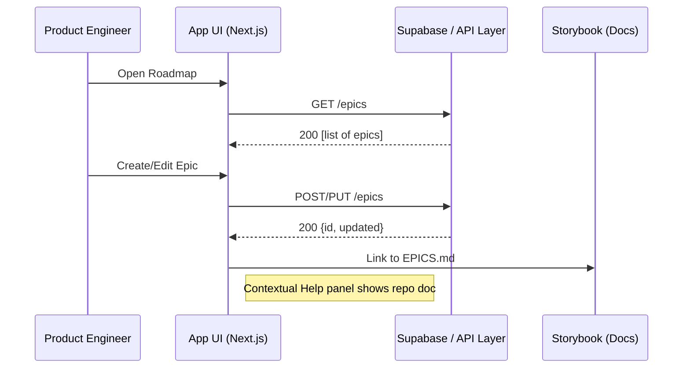
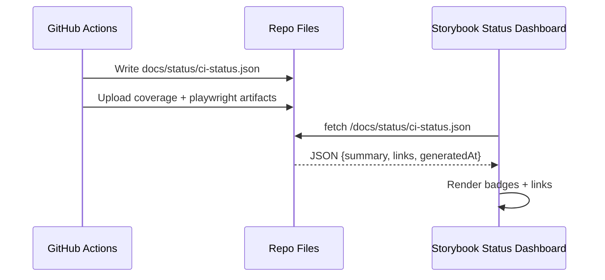
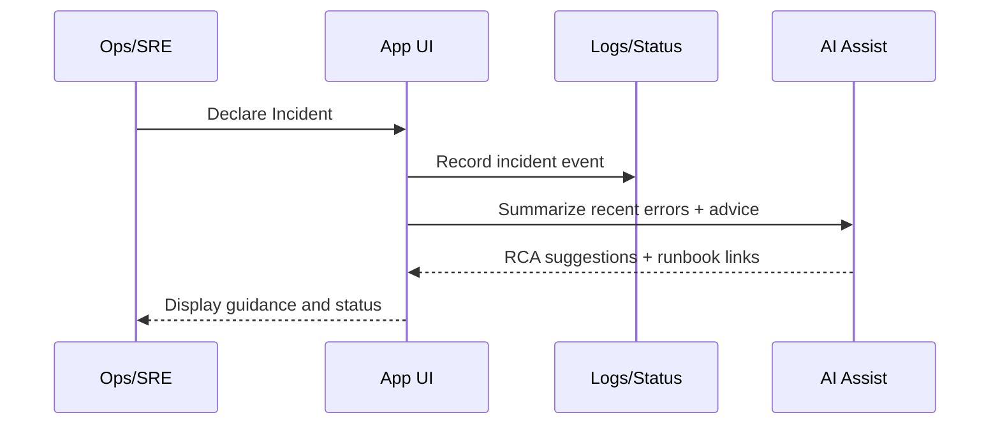
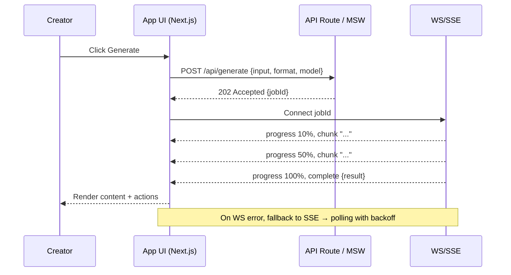
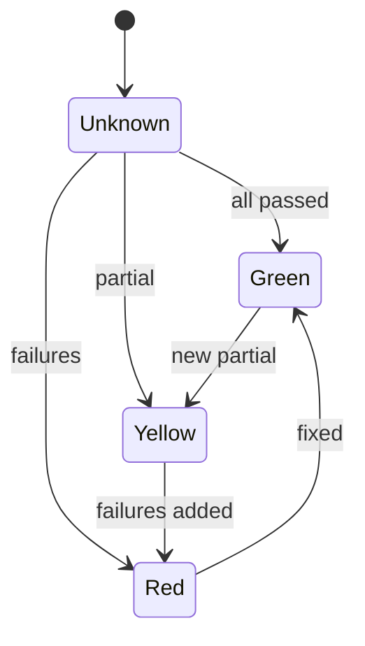
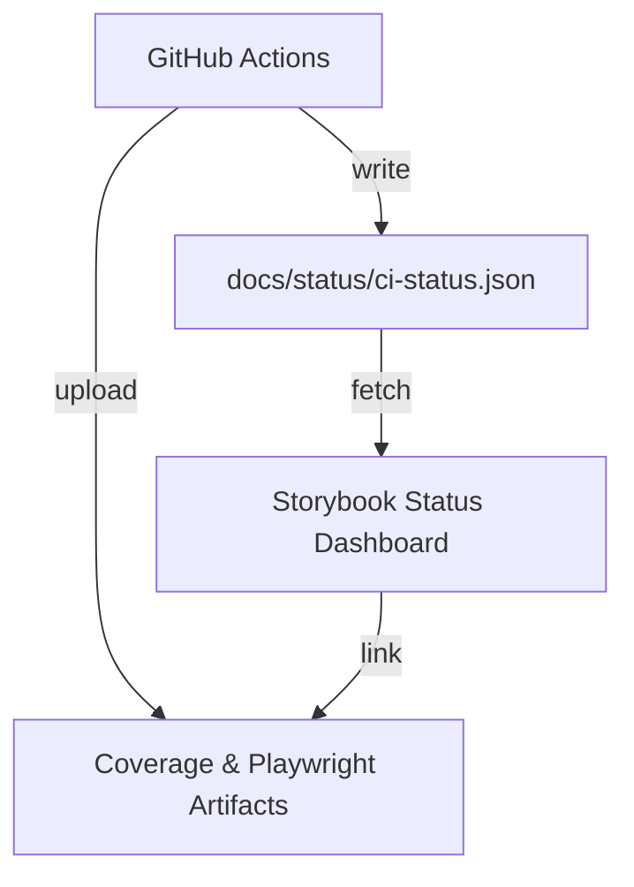
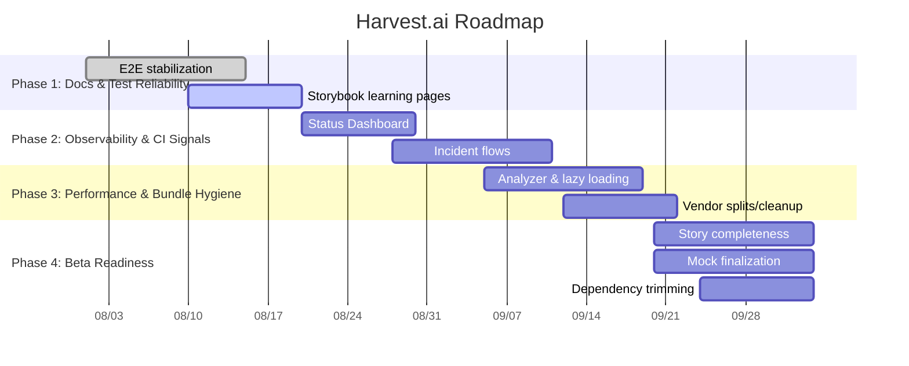

import * as React from "react";
import { Meta } from "@storybook/addon-docs";
import LastUpdated from "./components/LastUpdated";
import InlineToc from "./components/InlineToc";

export const parameters = {
  repoDocPath: "/docs/roadmap/EPICS.md",
  repoDocLabel: "Roadmap & Epics",
};

# Harvest.ai — Product & System Overview

<a id="top"></a>

<Meta title="Overview/Overview (Insanely Detailed)" />

## On this page

<InlineToc
  items={[
    { href: "#vision", label: "Vision" },
    { href: "#north-star", label: "North Star" },
    { href: "#product-core", label: "Product core" },
    { href: "#technology-list-consolidated", label: "Technology list" },
    { href: "#user-journeys-lifecycle", label: "User journeys & lifecycle" },
    { href: "#product-pillars", label: "Product pillars" },
    { href: "#product-goals-success-metrics", label: "Product goals & success metrics" },
    { href: "#non-goals-assumptions-v1", label: "Non-goals & assumptions (v1)" },
    { href: "#personas", label: "Personas" },
    { href: "#system-context-mermaid", label: "System context (Mermaid)" },
    { href: "#service-dependency-graph-mermaid", label: "Service dependency graph (Mermaid)" },
    { href: "#domain-data-model-erd", label: "Domain & data model (ERD)" },
    { href: "#high-level-sequence-diagrams", label: "High-level sequence diagrams" },
    { href: "#feature-catalog", label: "Feature catalog" },
    { href: "#30-user-stories-with-ac-alterror-flows-observability", label: "30 user stories" },
    { href: "#system-status-mermaid", label: "System Status (Mermaid)" },
    { href: "#non-functional-requirements", label: "Non-functional requirements" },
    { href: "#security-privacy-model", label: "Security & Privacy model" },
    { href: "#testing-strategy", label: "Testing strategy" },
    { href: "#storybook-learning-demos", label: "Storybook learning & demos" },
    { href: "#phased-roadmap", label: "Phased roadmap" },
    { href: "#view-in-storybook", label: "View in Storybook" },
    { href: "#extras", label: "Extras" },
  ]}
/>

## Vision

<div style={{ textAlign: "right" }}>
  <a href="#top">Back to top</a>
</div>

Harvest.ai turns raw inputs into polished content and insights with fast, transparent feedback. It is built mock-first and contract-first to accelerate iteration without waiting on backend availability, and it embeds docs, tests, and observability into the daily developer workflow.

## North Star

- Be the most trusted way to turn raw input into a publishable draft in under 90 seconds, with full cost transparency and zero lock‑in.

### metric

- Time to First Useful Output (TTFUO) P90 ≤ 90 seconds

### Trust guardrails (supporting KPIs)

- Transparency Trust Score: price-verification rate ≤ 5%
- Export Success Rate: 100% (no lock-in)
- Crisis Return Rate: ≥ 90% of users come back during their next urgent need
- Quality Acceptance Rate: ≥ 80% outputs accepted without major rework

### Why this fits

- It ties to our crisis-first value, radical transparency, and trust posture. Panic/Flow/Power flows serve the 90-second useful-draft goal; BYOK + export reinforce trust.

## Product core

- What it is: An AI content transformation platform that turns any source (notes, docs, URLs, files) into professional outputs (blog posts, summaries, emails, quizzes, presentations), with a trust-first posture.
- Trust-first principles:
  - BYOK privacy: users bring their own AI provider keys; no vendor lock-in; export everything.
  - Radical transparency: clear, per-request cost breakdown and quality scoring.
  - Honest UX: realistic expectations, explicit errors, and easy exit (full export).
- Delivery surfaces:
  - Web app: simple “demo” and production UX with real-time streaming, quality/cost metrics, caching, and rate-limiting.
  - Developer platform: REST/SSE endpoints (and future SDK/webhooks) for integration and batch.
- Multi-provider engine:
  - OpenAI, Anthropic, Google AI supported with fallback and provider selection.
  - Streaming via SSE for real-time token/partial output; caching for repeat requests.
- Modes that meet users where they are:
  - Panic Mode: one-click “help me now” emergency flow.
  - Flow Mode: guided, low-friction creative workflow.
  - Power Mode: advanced controls, batching, templates, and team workflows.
- Enterprise track:
  - Security/compliance (BYOK, SOC2 posture, auditability), trust packages, pilot playbooks, and SLAs.
- Product ambition:
  - Be there exactly when needed (crisis timing), deliver exactly what’s promised (transparency), and scale from single-output wins to enterprise bulk.

## Technology list (consolidated)

- Core app
  - Next.js (App Router), TypeScript, React, Tailwind CSS, Radix UI, Framer Motion
  - MDX docs in-app; Storybook for interactive docs and playgrounds
- Data & networking (frontend)
  - React Query, fetch; date-fns; zod + react-hook-form (validation)
- Realtime and streaming
  - SSE for streaming; mock-socket in dev; progressive enhancement WS → SSE → polling (documented)
- AI providers and backend logic
  - Provider adapters: OpenAI, Anthropic, Google Generative AI; fallback and env-gated
  - Request correlation IDs, cost/quality metrics, caching, and rate-limits
- Persistence and platform (current/planned)
  - Supabase (auth, Postgres) for accounts, usage, and collaboration (planned/partly implemented)
  - Redis (optional) for cache and rate limiting (dev/ops path described)
- Observability and security
  - Sentry, Vercel Analytics, custom metrics and health; CORS and API hardening
- Testing, mocks, and docs
  - Jest + Testing Library, Playwright E2E, MSW for REST mocks, Storybook 9, optional Chromatic
  - Swagger UI at /docs/api backed by /api/openapi.json (contract-first docs)
- CI/CD and ops
  - GitHub Actions (type-check, lint, coverage thresholds, E2E, Storybook build)
  - Vercel deployment; Cloudflare/CDN posture; runbooks for deployment, troubleshooting, development
- Dev tools
  - Headers for mock network controls (delay/error rate), SSE viewer, API playground, smoke scripts

## User journeys & lifecycle

- Acquisition to Activation (trust-first and crisis-aware)
  - Landing → Rapid trust checks (cost transparency, honest quality scores) → Quick “Try the Demo”
  - Crisis-aware entry: if urgent patterns detected, show Panic Mode (“Save my night”; minimal inputs; cost visible)
- Onboarding (when accounts are enabled)
  - Signup → Email verification → Onboarding survey (use case, formats, volume) → BYOK configuration and validation
  - Trust ladder: progressively reveal power, surface costs/quality honestly, offer no-risk retries
- First value delivery: content generation flow
  - Select format → Provide source (text/URL/file) → Configure options/model → Generate
  - Realtime streaming (SSE): meta/tokens/partials → Quality + cost + latency metrics → Edit → Export (copy/download)
  - Caching enables instant subsequent runs; rate limits enforced with clear retry guidance
- Growth and return usage
  - Flow Mode: guided drafting and refining; saves time and educates user on best practices
  - Power Mode: batch generation, templates, histories, and (later) team collaboration
  - Nudges and timing: proactive suggestions aligned with calendars and prior behavior
- Monetization and plans (when enabled)
  - Free tier caps → Upgrade prompt → Plan selection → Payment → Unlock Pro/Team features
- Developer integration journey
  - Read API docs (Swagger UI) → Create API key(s) → Quick-start client → POST /api/generate or /generate/stream (SSE)
  - Webhooks/async jobs for batch and long-running flows; monitoring for rate/latency/usage
- Enterprise adoption journey
  - Security/compliance review (BYOK, auditability, DPA, posture docs) → Pilot program with success metrics → Rollout plan and SLAs
- Error and recovery flows (trust-preserving)
  - Input validation (clear messages), rate limit and quota handling (timers/backoff), provider failover, retries
  - Export and leave paths are explicit and easy; support touchpoints are direct and human
- Lifecycle connection (single narrative)
  - Attract (trust-first, timely value) → Onboard (BYOK, survey) → Activate (first generation success)
  - Retain (Flow/Power modes, templates, caching) → Monetize (plans) → Expand (teams, batch, API)
  - Enterprise: parallel “trust package → pilot → rollout” track that shares the same generation core

### Product pillars

- Mock-first UX: deterministic MSW mocks and simulated realtime for rapid iteration and demos
- Contract-first API: Swagger UI and OpenAPI spec visible in Storybook and the app
- Docs-as-product: Storybook docs, MDX pages, and contextual Help links across the UI
- Quality gates: a11y checks, unit coverage, E2E streaming tests, smoke checks
- Observability-first: status JSON, dashboards in Storybook, and event tracking
- Performance & hygiene: bundle analysis, lazy loading, tree-shaking, split vendor chunks

## Product goals & success metrics

- North Star (Creator): time-to-first-draft (TTFD) ≤ 30s P95 in mock/dev; ≤ 60s in real mode
- Quality: Creator thumbs-up rate ≥ 75% in dogfood; revision ratio ≤ 1.5x
- Reliability: CI/E2E/Storybook pass rate ≥ 90% weekly; a11y serious/critical = 0 on core flows
- DX: New contributor setup ≤ 10 minutes; first green PR ≤ 1 day
- Performance: Storybook initial JS payload −20% from baseline; app LCP < 2.5s P75 (example target)

## Non-goals & assumptions (v1)

- Non-goals: full CMS, complex workflow engine, multi-tenant billing/entitlements
- Assumptions: mock-first development acceptable for demos/tests; contracts drive backend alignment; single-region deployment for v1

---

## Personas

- Creator (end user): transforms content (blog/email/summary/quiz) and exports results
- Product engineer: builds features, maintains mocks, stories, and tests
- QA / DX engineer: stabilizes E2E, monitors a11y, curates docs and fixtures
- Ops / SRE: monitors status, handles incidents and releases

## System context (Mermaid)



## Service dependency graph (Mermaid)

<div style={{ textAlign: "right" }}>
  <a href="#top">Back to top</a>
</div>



## Domain & data model (ERD)

```mermaid path=null start=null
erDiagram
  USER ||--o{ CONTENT_DRAFT : authors
  CONTENT_DRAFT ||--o{ GENERATION_RUN : produces
  TEMPLATE ||--o{ CONTENT_DRAFT : applies
  EPIC ||--o{ STATUS_ARTIFACT : references
  INCIDENT ||--o{ STATUS_ARTIFACT : records

  USER {
    string id
    string email
    string role
  }
  CONTENT_DRAFT {
    string id
    string title
    text body
    string format
    datetime createdAt
  }
  GENERATION_RUN {
    string id
    string draftId
    string model
    float temperature
    string status
    datetime startedAt
    datetime finishedAt
  }
  TEMPLATE {
    string id
    string name
    string format
  }
  EPIC {
    string id
    string title
    string status
  }
  INCIDENT {
    string id
    string severity
    string summary
  }
  STATUS_ARTIFACT {
    string id
    string type  // coverage, e2e, storybook
    string url
    datetime generatedAt
  }
```

### Extended ERD (Organizations, API Keys, Audit Events)

```mermaid path=null start=null
erDiagram
  ORGANIZATION ||--o{ MEMBERSHIP : has
  USER ||--o{ MEMBERSHIP : joins
  ORGANIZATION ||--o{ API_KEY : issues
  USER ||--o{ API_KEY : creates
  USER ||--o{ AUDIT_EVENT : triggers
  CONTENT_DRAFT ||--o{ AUDIT_EVENT : context

  ORGANIZATION {
    string id
    string name
    string tier // free, pro, team, enterprise
    datetime createdAt
  }
  MEMBERSHIP {
    string id
    string orgId
    string userId
    string role // owner, admin, member
  }
  API_KEY {
    string id
    string orgId
    string userId
    string name
    datetime createdAt
    datetime lastUsedAt
    boolean active
  }
  AUDIT_EVENT {
    string id
    string userId
    string orgId
    string type // generate, export, incident_open, login
    string ip
    string userAgent
    datetime createdAt
  }
```

---

## High‑level sequence diagrams

### Epic CRUD (product roadmap)



### Status refresh (CI → Storybook)



### Incident + AI Assist



### Generation flow (streaming)



---

## Feature catalog

<div style={{ textAlign: "right" }}>
  <a href="#top">Back to top</a>
</div>
- Epics & Roadmap: browse, CRUD epics; link to repo docs - System Status: CI/E2E/Storybook results
in a Status Dashboard - AI Assist: contextual hints, suggested runs, and doc links - Docs & Help:
Storybook MDX, repoDocPath help panel, API playgrounds - Quality Gates: a11y checks, unit coverage
gates, E2E against mocks - Observability: status JSON, incident markers, event taxonomy

---

## 30 user stories (with AC, alt/error flows, observability)

<div style={{ textAlign: "right" }}>
  <a href="#top">Back to top</a>
</div>

1. As a Creator, I can generate a blog post from text.

- AC: valid input enables Generate; shows progress; renders formatted output; copy/download available
- Errors: 429 shows retry-after hint; 401 shows API key help; 5xx shows retry
- Events: hvt_generate_click, hvt_generate_success, hvt_generate_error

2. As a Creator, I can choose output format (email, summary, quiz, presentation, social).

- AC: format select persists; tailored template renders
- Errors: invalid selection falls back to default format
- Events: hvt_format_change, hvt_template_render

3. As a Creator, I can adjust tone/length/language.

- AC: controls update preview and request payload
- Errors: out-of-range values clamped and warned
- Events: hvt_tone_change, hvt_length_change, hvt_lang_change

4. As a Creator, I can copy or download generated content.

- AC: copy to clipboard; download text file with naming convention
- Errors: clipboard permission fallback to manual selection
- Events: hvt_copy, hvt_download

5. As a Creator, I see streaming progress during generation.

- AC: progress bar; chunked text appears; completion toast
- Errors: WS failure falls back to SSE → polling
- Events: hvt_stream_start, hvt_stream_chunk, hvt_stream_complete

6. As a Creator, I can retry after rate limit.

- AC: CTA enabled after retry-after window
- Errors: repeated 429 shows backoff advice
- Events: hvt_retry_click, hvt_retry_delay_observed

7. As a Creator, I can view API docs.

- AC: Swagger UI loads spec; “Try It Out” enabled in dev
- Errors: live spec unavailable → snapshot fallback
- Events: hvt_swagger_open, hvt_swagger_try

8. As a Creator, I can view inline help.

- AC: Help panel shows relevant repo doc
- Errors: missing doc path hides panel
- Events: hvt_help_open, hvt_help_click

9. As a Creator, I can switch dark/light themes for embeds.

- AC: EcosystemWidget renders in selected theme
- Errors: invalid theme defaults to dark
- Events: hvt_theme_toggle

10. As a Product Engineer, I can see Status Dashboard.

- AC: badges for unit/E2E/Storybook; links to artifacts
- Errors: missing JSON shows helpful empty state
- Events: hvt_status_view, hvt_status_links_click

11. As a Product Engineer, I can run docs playgrounds.

- AC: POST /api/generate playground; TRIGGER\_\* inputs simulate paths
- Errors: network errors explained with MSW enabled notice
- Events: hvt_playground_call, hvt_playground_result

12. As a Product Engineer, I can adjust mock latency/error.

- AC: headers x-mock-delay, x-mock-error-rate applied
- Errors: invalid values clamped
- Events: hvt_mock_delay_set, hvt_mock_error_rate_set

13. As a Product Engineer, I can browse Epics.

- AC: loads epics; supports filters
- Errors: offline fallback with placeholder epics
- Events: hvt_epic_list_view

14. As a Product Engineer, I can create/update epics.

- AC: validate required fields; optimistic UI
- Errors: conflicts show merge guidance
- Events: hvt_epic_create, hvt_epic_update

15. As a Product Engineer, I can link epics to docs.

- AC: repoDocPath or link field; opens in new tab
- Errors: broken links flagged in link-check CI
- Events: hvt_epic_doc_open

16. As QA/DX, I can run a11y checks in Storybook.

- AC: a11y addon shows serious/critical issues
- Errors: unsupported elements are skipped
- Events: hvt_a11y_check_open, hvt_a11y_violation

17. As QA/DX, I can run unit tests with coverage gates.

- AC: thresholds enforced; report uploaded
- Errors: failing thresholds block status to “red”
- Events: hvt_unit_run, hvt_coverage_upload

18. As QA/DX, I can run E2E against mocks.

- AC: Playwright runs against dev:mock; artifacts uploaded
- Errors: flaky tests marked and quarantined
- Events: hvt_e2e_run, hvt_e2e_artifacts

19. As QA/DX, I can see streaming selectors stabilized.

- AC: data-testid present on key UI
- Errors: missing test IDs flagged in PR review
- Events: hvt_selector_check

20. As QA/DX, I can view Storybook learning pages.

- AC: Performance & Bundling page renders and links to guide
- Errors: analyzer missing shows non-blocking warn
- Events: hvt_learning_open

21. As Ops/SRE, I can see CI status over time.

- AC: generatedAt timestamp; links to last artifacts
- Errors: stale JSON prompts refresh hint
- Events: hvt_status_refresh

22. As Ops/SRE, I can declare an incident.

- AC: incident banner visible; status page link
- Errors: duplicate declaration prevented
- Events: hvt_incident_open, hvt_incident_resolve

23. As Ops/SRE, I can receive AI suggestions during an incident.

- AC: top 3 actions with runbook links
- Errors: missing data reduces confidence badge
- Events: hvt_ai_suggest_view, hvt_ai_suggest_click

24. As Ops/SRE, I can export a status snapshot.

- AC: export JSON; attach to ticket
- Errors: export failures retriable
- Events: hvt_status_export

25. As Security, I see secrets not exposed in client stories.

- AC: server secrets never imported into client code
- Errors: lints fail on accidental import
- Events: hvt_secret_guard_violation

26. As Security, I can enforce dependency policies.

- AC: allowlist/denylist checks; alerts filed
- Errors: block on high severity CVEs
- Events: hvt_dep_audit_run

27. As Accessibility lead, I see WCAG AA targets.

- AC: contrast, focus, aria labels satisfied in key flows
- Errors: a11y violations logged and triaged
- Events: hvt_a11y_goal_check

28. As Performance owner, I run analyzer on-demand.

- AC: on-demand CI job builds Storybook with ANALYZE=1
- Errors: analyzer missing shows instruction
- Events: hvt_analyze_run, hvt_analyze_artifact

29. As Internationalization owner, I can translate strings.

- AC: i18n keys loaded; RTL layouts previewable
- Errors: missing key falls back to default language
- Events: hvt_i18n_load, hvt_i18n_missing

30. As Documentation owner, I export printable overview.

- AC: print stylesheet or MD-to-PDF pipeline available
- Errors: image assets scaled appropriately
- Events: hvt_docs_export

---

## System Status (Mermaid)

### Status badge logic



### Data flow for status



---

## Non‑functional requirements

- Performance: initial Storybook payload reduced via lazy loading and tree-shaking; analyzer used monthly
- Accessibility: serious/critical a11y issues addressed; keyboard and screen reader coverage on key flows
- Security: no secrets in client bundles; dep audit in CI; CSP and headers documented
- Observability: status JSON, incident markers, event taxonomy; logs retained for debug
- i18n: core UI strings externalized; RTL preview supported in Storybook

## Security & Privacy model

- Roles: visitor, creator, admin; role-driven UI access (no hidden-server-only functions on client)
- Data handling: draft content may contain PII; avoid logging full bodies; mask/redact when necessary
- Secrets: store server-only secrets on the server; expose only NEXT*PUBLIC*\* intended for the client
- Transport & headers: HTTPS-only; plan CSP, Referrer-Policy, Permissions-Policy; secure cookies for auth
- Audit trail: log high-value actions (generate, export, incident) with minimal payloads

---

## Testing strategy

- Unit tests: Jest + RTL; coverage thresholds enforced
- E2E tests: Playwright against mock server; streaming waits
- a11y scans: axe-core/playwright focused on serious/critical issues
- Visual diffs (optional): Chromatic manual workflow only, keep private
- Smoke: post-deploy script hits /, /docs/api, /api/openapi.json

---

## Storybook learning & demos

- Docs/Tech Stack & API Playground
- Docs/Swagger UI (fallback to snapshot if dev server is down)
- Docs/Performance & Bundling (analyzer + lazy loading example)
- Docs/Status Dashboard (reads CI JSON)

---

## Phased roadmap

- Phase 1: Docs & Test Reliability (stabilize E2E, add learning pages, status pipeline)
- Phase 2: Observability & CI Signals (expand status, incident flows, artifacts)
- Phase 3: Performance & Bundle Hygiene (analyzer, lazy loading, vendor splits)
- Phase 4: Beta Readiness (complete stories, finalize mocks, trim dependencies)

### Timeline (Mermaid Gantt)



---

## View in Storybook

- Start app (optional API live): `npm run dev:mock`
- Start Storybook: `npm run storybook`
- Open: Docs/Harvest.ai Overview

---

<LastUpdated file="src/stories/HarvestOverview.stories.mdx" />

## Extras

- Want a printable PDF export of this overview? I can add a print stylesheet or a docs-to-PDF script.
- Need more diagrams? I can include a service dependency graph and a data model ERD.
