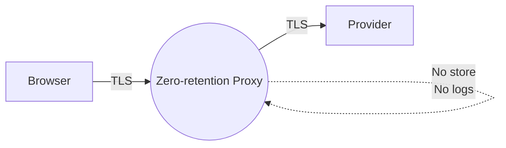

import React from "react";
import { Meta, Canvas, Story } from "@storybook/addon-docs/blocks";
import LastUpdated from "./components/LastUpdated";

export const parameters = {
  repoDocPath: "/docs/specs-security-privacy--docs",
  repoDocLabel: "Security & Privacy",
};

# Security & Trust Plan — Session-only BYOK, Zero-retention Proxy

<Meta title="Docs/Security & Trust" />

> Goal: Provide a strong secure-feeling BYOK experience without auth or persistence by combining session-only key handling, a zero‑retention proxy posture, and visible proof in the UI.

## Trust posture (current phase: no backend/auth)

- Session-only BYOK: key stays in memory only; auto-wipes after inactivity or tab close.
- Zero-retention proxy: accept X-Provider and X-Provider-Key; use once; never store or log.
- Transport & cache controls: HTTPS/HSTS; CSP with tight connect-src; Cache-Control: no-store on API responses.
- Radical transparency: data-flow card, sanitized request view, “what we store” list (request id, timing, model; never your key).

## Why this is cheaper now

- No database, no auth, no key vault needed to start.
- Mock-first adapters keep provider calls replaceable; BYOK is per-request/session.
- Most value via UX, headers, and redaction—not infra.

## What this is NOT (yet)

- Not storing user keys or content.
- Not compliant storage (need auth, encryption at rest, rotation).
- Not team sharing or multi-device persistence.

## Controls checklist

- Transport: HTTPS+HSTS; strict CSP; single-origin CORS; deny mixed content.
- No-store: Cache-Control: no-store on sensitive API responses.
- Redaction: keys and content never logged; error messages sanitized.
- Rate limit: per-IP limiter on proxy endpoints; body size caps.
- Observability: metrics & IDs without secrets; optional one-way key fingerprint.

## Tests (TDD)

- Unit: sanitizer removes keys from logs/errors; key detector regexes.
- Integration: /api/generate returns 400 when BYOK mode missing key; never echoes key; sets no-store headers.
- E2E: BYOK input → request carries provider headers (intercepted in mock) → panic wipe clears state.

## Data flow

## Next steps

1. Add Security Playground (interactive BYOK session-only demo).
2. Add security headers to Next.js (CSP, HSTS, COOP/COEP, no-store on API).
3. Add redaction utilities and tests.

<LastUpdated file="src/stories/SecurityTrustPlan.stories.mdx" />
