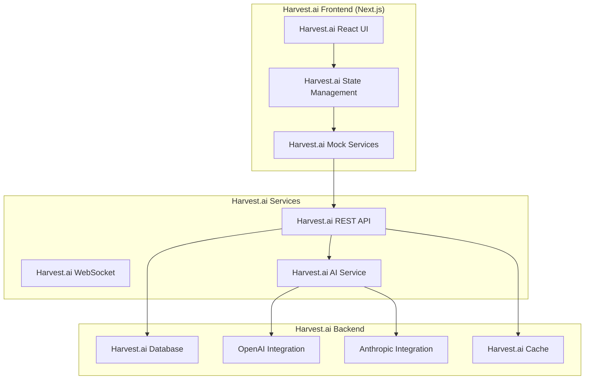

# 📚 Harvest.ai Documentation Master Index

> Project: Harvest.ai - AI-Powered Content Generation Platform  
> Last Updated: August 2025  
> Version: 0.2.0 (Early Alpha)  
> Status: Active Development  
> Repository: NatureQuest/Harvest.ai

## 🎯 Quick Navigation

| Category                                | Description                              | Status         |
| --------------------------------------- | ---------------------------------------- | -------------- |
| [Getting Started](#getting-started)     | Setup, installation, and first run       | ✅ Complete    |
| [Architecture](#architecture)           | System design and technical architecture | ✅ Complete    |
| [User Journeys](#user-journeys)         | Complete user flows and interactions     | 🔄 In Progress |
| [API Documentation](#api-documentation) | REST API and WebSocket specifications    | 🔄 In Progress |
| [Component Library](#component-library) | UI components and design system          | 🔄 In Progress |
| [Testing](#testing)                     | Test strategies and coverage             | ✅ Complete    |
| [AI Features](#ai-features)             | AI capabilities and integrations         | 🔄 In Progress |
| [Operations](#operations)               | Deployment and maintenance               | ✅ Complete    |
| [Troubleshooting](#troubleshooting)     | Error handling and debugging             | 📝 Planned     |

## 📋 Documentation Inventory

### Core Documentation

- [README.md](./README.md) - Main project overview
- [TESTING.md](./TESTING.md) - Testing documentation
- [.env.example](./env.example) - Environment configuration
- [docs/roadmap/EPICS.md](./docs/roadmap/EPICS.md) - Epics and tasks

### Strategy & Planning

- [docs/IMPLEMENTATION_STRATEGY.md](./docs/IMPLEMENTATION_STRATEGY.md) - Development roadmap
- [docs/MOCK_FIRST_STRATEGY.md](./docs/MOCK_FIRST_STRATEGY.md) - Mock-first development approach
- [docs/REALITY_CHECK.md](./docs/REALITY_CHECK.md) - Project status assessment
- [docs/MAKE_IT_WORK.md](./docs/MAKE_IT_WORK.md) - Pragmatic implementation guide
- [docs/status/implementation-progress.md](./docs/status/implementation-progress.md) - Implementation progress

### System Documentation

- [docs/SYSTEM_STATUS.md](./docs/SYSTEM_STATUS.md) - Current system status
- [docs/IMPLEMENTATION_SUMMARY.md](./docs/IMPLEMENTATION_SUMMARY.md) - Implementation overview
- [docs/architecture/SYSTEM_ARCHITECTURE.md](./docs/architecture/SYSTEM_ARCHITECTURE.md) - Technical architecture

### API & Services

- [docs/api/REST_API.md](./docs/api/REST_API.md) - REST API specification
- [docs/api/COMPLETE_API_SPEC.md](./docs/api/COMPLETE_API_SPEC.md) - Comprehensive API spec
- Swagger UI: /docs/api (renders /api/openapi.json)
- WebSocket API - planned documentation

### User Experience

- [docs/user-journeys/CONTENT_TRANSFORMATION.md](./docs/user-journeys/CONTENT_TRANSFORMATION.md) - Content transformation flows
- [docs/user-journeys/USER_FLOWS.md](./docs/user-journeys/USER_FLOWS.md) - Complete user flows _(to be created)_

### Development

- [docs/runbooks/DEVELOPMENT.md](./docs/runbooks/DEVELOPMENT.md) - Development runbook
- [docs/runbooks/OPERATIONS_BOOK.md](./docs/runbooks/OPERATIONS_BOOK.md) - Operations Book (local & prod, MSW, Storybook, E2E, CI)
- [docs/runbooks/PRODUCTION_CHECKLIST.md](./docs/runbooks/PRODUCTION_CHECKLIST.md) - Pre-release production checklist
- [docs/status/LOCAL_DEV_GUIDE.md](./docs/status/LOCAL_DEV_GUIDE.md) - Local development guide (mock runtime, Storybook, tests)
- [docs/testing/TESTING.md](./docs/testing/TESTING.md) - Testing & CI (consolidated)
- [docs/status/implementation-progress.md](./docs/status/implementation-progress.md) - Implementation progress

---

## Getting Started

### 🚀 Quick Start Guide for Harvest.ai

```bash
# 1. Clone the Harvest.ai repository
git clone https://github.com/NatureQuest/Harvest.ai.git
cd Harvest.ai/frontend

# 2. Install dependencies
npm install

# 3. Configure environment
cp env.example .env.local

# 4. Run with mocks (no backend required)
npm run dev:mock

# 5. Access the application
open http://localhost:3002
```

### 📦 Harvest.ai Project Structure

```
Harvest.ai/frontend/
├── src/                    # Harvest.ai source code
│   ├── app/               # Harvest.ai Next.js app
│   ├── components/        # Harvest.ai React components
│   ├── hooks/            # Harvest.ai custom hooks
│   ├── lib/              # Harvest.ai utilities
│   ├── mocks/            # Harvest.ai MSW mocks
│   ├── services/         # Harvest.ai API services
│   ├── stores/           # Harvest.ai state stores
│   ├── styles/           # Harvest.ai styles
│   └── types/            # Harvest.ai TypeScript types
├── public/               # Harvest.ai static assets
├── tests/                # Harvest.ai test suite
└── docs/                 # Harvest.ai documentation

Harvest.ai Statistics:
- Total Files: 52 TypeScript/TSX files
- Test Coverage: 52 test cases (87% passing)
```

---

## Architecture

### 🏗️ Harvest.ai System Architecture



### 🔧 Technology Stack

| Layer      | Technology              | Purpose            | Status           |
| ---------- | ----------------------- | ------------------ | ---------------- |
| Frontend   | Next.js 15              | React framework    | ✅ Active        |
| UI         | Tailwind CSS            | Styling            | ✅ Active        |
| Components | shadcn/ui               | Component library  | ✅ Active        |
| State      | Zustand                 | State management   | ✅ Active        |
| Mocking    | MSW                     | API mocking        | ✅ Active        |
| Testing    | Jest + RTL, Playwright  | Unit/E2E           | 🟡 In Progress   |
| Database   | Supabase                | Backend            | 🔄 Planned       |
| AI         | OpenAI/Anthropic/Gemini | Content generation | 🔄 Keys Required |
| Cache      | Redis                   | Performance        | 📝 Planned       |
| Analytics  | PostHog                 | Usage tracking     | 📝 Planned       |

---

## User Journeys

### 👤 Harvest.ai Primary User Flows

#### 1. Content Generation Flow

```
Start → Select Format → Enter Content → Configure Options → Generate → Review → Export
```

#### 2. Authentication Flow

```
Landing → Sign Up/Login → Email Verification → Dashboard → Profile Setup
```

#### 3. Subscription Flow

```
Free Tier → View Plans → Select Plan → Payment → Confirmation → Pro Features
```

### 📊 Harvest.ai User Personas

1. **Content Creator** - Uses Harvest.ai for quick content transformation
2. **Educator** - Creates educational materials with Harvest.ai
3. **Marketer** - Generates marketing content via Harvest.ai
4. **Developer** - Integrates Harvest.ai API for automation
5. **Team Lead** - Manages team content generation in Harvest.ai

---

## API Documentation

### 🔌 REST API Endpoints

#### Authentication

|| Method | Endpoint | Description | Status |
||--------|----------|-------------|--------|
|| POST | `/api/auth/signup` | User registration | ✅ Implemented (Supabase) |
|| POST | `/api/auth/login` | User login | ✅ Implemented (Supabase) |
|| POST | `/api/auth/logout` | User logout | ✅ Implemented (Supabase) |
|| GET | `/api/auth/session` | Get session | ✅ Implemented (Supabase) |
|| POST | `/api/auth/forgot-password` | Password reset | ✅ Mocked |

#### Content Generation

|| Method | Endpoint | Description | Status |
||--------|----------|-------------|--------|
|| POST | `/api/generate` | Generate content | ✅ Implemented (Hybrid: Supabase + AIService) |
|| GET | `/api/generations` | Get history | ✅ Implemented (Supabase) |
|| GET | `/api/generate/:id` | Get generation | ✅ Implemented (Supabase) |
|| DELETE | `/api/generate/:id` | Delete generation | ✅ Implemented (Supabase) |
|| POST | `/api/generate/batch` | Batch generation | ✅ Mocked |

#### User Management

| Method | Endpoint                 | Description      | Status    |
| ------ | ------------------------ | ---------------- | --------- |
| GET    | `/api/users/:id`         | Get profile      | ✅ Mocked |
| PATCH  | `/api/users/:id`         | Update profile   | ✅ Mocked |
| GET    | `/api/users/:id/usage`   | Get usage stats  | ✅ Mocked |
| GET    | `/api/users/:id/billing` | Get billing info | ✅ Mocked |

### 🔄 WebSocket Events

#### Client → Server

- `subscribe` - Subscribe to channel
- `generation_start` - Start generation
- `generation_cancel` - Cancel generation
- `ping` - Keep-alive

#### Server → Client

- `generation_progress` - Progress update
- `generation_stream` - Content streaming
- `generation_complete` - Generation done
- `notification` - System notification

---

## Component Library

### 🎨 Design System

#### Core Components

```typescript
// Button variants
<Button variant="default|destructive|outline|secondary|ghost|link" />

// Form controls
<Input type="text|email|password" />
<Textarea rows={4} />
<Select options={[]} />
<Checkbox checked={false} />
<RadioGroup value="" />

// Layout
<Card>
  <CardHeader />
  <CardContent />
  <CardFooter />
</Card>

// Feedback
<Alert variant="default|destructive" />
<Toast />
<Dialog />
<Spinner />
```

#### Custom Components

- `ContentGenerator` - Main generation interface
- `FormatSelector` - Content format selection
- `ModelSelector` - AI model selection
- `HistoryPanel` - Generation history
- `ExportDialog` - Export options
- `UsageMetrics` - Usage dashboard

### 🎯 Accessibility

All components follow WCAG 2.1 Level AA guidelines:

- Semantic HTML
- ARIA labels
- Keyboard navigation
- Focus management
- Screen reader support

---

## Testing

### 🧪 Test Coverage

Note: Coverage fluctuates. See CI artifacts or run locally.

```bash
npm run test:coverage
```

### Test Types

1. **Unit Tests** - Component and function testing
2. **Integration Tests** - API and service testing
3. **E2E Tests** - User flow testing (Playwright)
4. **Performance Tests** - Load and speed testing
5. **Accessibility Tests** - a11y compliance

### Running Tests

```bash
# Run all tests
npm test

# Run with coverage
npm run test:coverage

# Run E2E tests
npm run test:e2e

# Run in watch mode
npm run test:watch
```

---

## AI Features

### 🤖 Harvest.ai AI Capabilities

#### Supported Models

| Provider     | Models               | Use Case        | Status              |
| ------------ | -------------------- | --------------- | ------------------- |
| OpenAI       | GPT-4, GPT-3.5       | General content | 🔄 API Key Required |
| Anthropic    | Claude 3 Opus/Sonnet | Complex content | 🔄 API Key Required |
| Cohere       | Command              | Summaries       | 📝 Planned          |
| Hugging Face | Various              | Specialized     | 📝 Planned          |

#### Content Formats

1. **Blog Post** - SEO-optimized articles
2. **Email** - Professional emails
3. **Summary** - Text summarization
4. **Quiz** - Educational quizzes
5. **Presentation** - Slide content
6. **Social Media** - Platform-specific posts
7. **Code Documentation** - Technical docs
8. **Translation** - Multi-language

#### AI Features

- **Smart Prompting** - Context-aware suggestions
- **Tone Adjustment** - Professional/Casual/Formal
- **Length Control** - Word/character limits
- **Format Templates** - Pre-built templates
- **Batch Processing** - Multiple generations
- **History Learning** - Personalized results

---

## Operations

### 🚀 Deployment Guide

#### Development

```bash
npm run dev          # Standard dev server
npm run dev:mock     # With MSW mocks
npm run dev:debug    # With debugging
```

#### Production Build

```bash
npm run build        # Production build
npm run start        # Start production server
npm run analyze      # Bundle analysis
```

#### Environment Configuration

```env
# Required for production
NEXT_PUBLIC_SUPABASE_URL=your-supabase-url
NEXT_PUBLIC_SUPABASE_ANON_KEY=your-anon-key
OPENAI_API_KEY=your-openai-key
ANTHROPIC_API_KEY=your-anthropic-key

# Optional
REDIS_URL=redis://localhost:6379
SENTRY_DSN=your-sentry-dsn
POSTHOG_KEY=your-posthog-key
```

### 📊 Monitoring

#### Key Metrics

- Response time < 200ms (p95)
- Error rate < 0.1%
- Uptime > 99.9%
- Generation success rate > 95%

#### Monitoring Tools

- **Sentry** - Error tracking
- **PostHog** - Analytics
- **Vercel Analytics** - Performance
- **Custom Dashboard** - Business metrics

---

## Troubleshooting

### 🔍 Common Issues

#### Development Issues

| Issue             | Cause              | Solution                     |
| ----------------- | ------------------ | ---------------------------- |
| Port 3002 in use  | Another process    | `kill -9 $(lsof -t -i:3002)` |
| Module not found  | Missing dependency | `npm install`                |
| TypeScript errors | Type issues        | `npm run type-check`         |
| Test failures     | Mock issues        | Check MSW handlers           |

#### Production Issues

| Issue           | Cause            | Solution               |
| --------------- | ---------------- | ---------------------- |
| 500 errors      | Missing env vars | Check configuration    |
| Slow generation | Rate limits      | Implement caching      |
| Auth failures   | Token expired    | Refresh tokens         |
| CORS errors     | Origin mismatch  | Update allowed origins |

### 🐛 Debug Commands

```bash
# Validate types, lint, and run tests
npm run validate

# Unit tests
npm test

# E2E tests
npm run test:e2e
```

### 📞 Support Channels

1. **GitHub Issues** - Bug reports and features
2. **Discord** - Community support
3. **Email** - support@harvest.ai
4. **Documentation** - This guide

---

## 📈 Metrics & Analytics

### Performance Metrics

- **Page Load**: < 2s (target)
- **Time to Interactive**: < 3s
- **API Response**: < 500ms (p95)
- **Generation Time**: < 5s average

### Usage Metrics

- Daily Active Users
- Generations per User
- Feature Adoption Rate
- Error Rate by Feature

### Business Metrics

- Conversion Rate (Free → Pro)
- Retention Rate
- Customer Satisfaction (NPS)
- Support Ticket Volume

---

## 🔒 Security

### Security Measures

- JWT-based authentication
- Rate limiting on all endpoints
- Input sanitization
- SQL injection prevention
- XSS protection
- CSRF tokens
- Secure headers (CSP, HSTS)

### Compliance

- GDPR compliant
- CCPA compliant
- SOC 2 Type II (planned)
- PCI DSS (for payments)

---

## 📝 Contributing

### Development Workflow

1. Fork repository
2. Create feature branch
3. Make changes
4. Write tests
5. Update documentation
6. Submit pull request

### Code Standards

- ESLint configuration
- Prettier formatting
- TypeScript strict mode
- 80% test coverage minimum
- Documentation for public APIs

---

### 🗓️ Harvest.ai Roadmap

See the detailed [Epics & Tasks](./docs/roadmap/EPICS.md). High-level milestones:

- Foundation: Mock-first UI/UX, MSW coverage, Storybook completeness
- Backend Foundations: Supabase auth/content/usage
- Reliability: Unit/E2E stability, observability, CI quality gates
- Monetization: Billing & subscriptions, plans and usage limits
- Expansion: Team features, template marketplace, SDKs
- [ ] Scale Harvest.ai to 100k+ users

---

## 📚 Additional Resources

### Internal Documentation

- [Epics & Tasks](./docs/roadmap/EPICS.md)
- [Implementation Progress](./docs/status/implementation-progress.md)
- [System Architecture](./docs/architecture/SYSTEM_ARCHITECTURE.md)

### External Resources

- [Next.js Documentation](https://nextjs.org/docs)
- [Supabase Documentation](https://supabase.io/docs)
- [OpenAI API Reference](https://platform.openai.com/docs)
- [MSW Documentation](https://mswjs.io/docs)

### Tools & Utilities

- [Bundle Analyzer](http://localhost:3002/analyze)
- [Storybook](http://localhost:6006)
- [API Playground](http://localhost:3002/api-playground)
- [Mock Dashboard](http://localhost:3002/mock-dashboard)

---

## 📄 License

Harvest.ai - Proprietary Software  
Copyright © 2024 NatureQuest/Harvest.ai  
All rights reserved

---

## 👥 Harvest.ai Team

- **Product Owner**: Harvest.ai Product Strategy
- **Tech Lead**: Harvest.ai Architecture
- **Frontend Dev**: Harvest.ai UI/UX Implementation
- **Backend Dev**: Harvest.ai API Development
- **AI Engineer**: Harvest.ai ML/AI Integration
- **DevOps**: Harvest.ai Infrastructure
- **QA Engineer**: Harvest.ai Quality Assurance

---

## 📞 Harvest.ai Contact

- **Email**: support@harvest.ai
- **GitHub**: [NatureQuest/Harvest.ai](https://github.com/NatureQuest/Harvest.ai)
- **Website**: https://harvest.ai
- **API Documentation**: https://api.harvest.ai/docs

---

_This document is maintained in-repo. Last update: August 2025_
