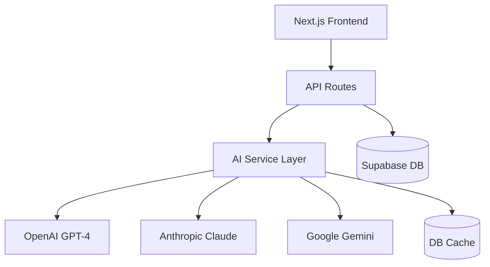

# 🚀 Harvest.ai — Demo Tour Mode (Vercel) + Local Dev

[](../../actions)

This repo is configured for a guided DEMO experience in production (Vercel) and flexible development locally.

- Production (Vercel): DEMO/Tour mode is always on (MSW mocks enabled). Includes a login gate and Storybook Presenter.
- Local development: You can turn the tour off, or run with mocks on demand. Storybook runs side-by-side.

---

## What’s included

- Non-dismissable, URL/env-triggered Demo Tour overlay (app) and Presenter overlay (Storybook)
- MSW mocks auto-enabled in demo mode, WebSocket mocks for streaming
- Password-protected login gate (cookie-based) for main app
- “Protected/BETA demo” banner with link to Storybook Presenter
- “Tour is on” watermark (app + Storybook)
- Storybook build/export for hosting at /storybook in production
- CI pipeline: unit + e2e + storybook tests, artifacts, and Pages deploy for Storybook (main/master)

---

## Branches

- master (or main): production branch, deploys Storybook to GitHub Pages (if enabled)
- staging: CI runs (tests + artifacts), no Pages deploy
- dev: CI runs (tests + artifacts), no Pages deploy

Update branch protections as desired in your GitHub repo settings.

---

## Environment variables

Production (Vercel):

- NEXT_PUBLIC_TOUR_AUTO=1
- SITE_USE_LOGIN=1
- SITE_DEMO_PASSWORD=<choose-a-demo-password>

Optional:

- STORYBOOK_BASIC_AUTH=username:password (protect /storybook if served via Pages or reverse proxy)
- SITE_BASIC_AUTH=username:password (fallback basic auth if you don’t use the login flow)

Local development:

- You can disable demo tour by NOT setting NEXT_PUBLIC_TOUR_AUTO.
- You can explicitly suppress the tour via URL only in development: add ?tour=off to any URL.
- To force mock/demo mode locally, use ?tour=1 or run npm run dev:mock.

---

## Quick start

Install dependencies:

```bash
npm ci
```

Run app + Storybook (local):

```bash
# App with mocks on 3002; Storybook on 6006
npm run dev:all
```

Just the app (no Storybook):

```bash
npm run dev           # 3000
npm run dev:mock      # 3002 (MSW on)
```

Just Storybook:

```bash
npm run storybook     # 6006
```

---

## Demo flow (production)

1. User visits your DNS → /login appears (cookie-based gate)
2. After login → redirect to /?tour=1
3. MSW mocks are enabled, Demo Tour starts automatically and cannot be turned off in production
4. Banner links to Storybook Presenter (tour=1)

---

## CI (GitHub Actions)

Workflow: .github/workflows/ci-storybook-tests.yml

- Triggers:
  - push: main, master, staging, dev
  - pull_request: all branches
- Jobs:
  - Install deps, install Playwright browsers
  - Unit tests with coverage (Jest)
  - E2E tests (Playwright)
  - Storybook Playwright tests
  - Build Storybook and upload artifacts
  - Deploy Storybook to GitHub Pages on main/master

Artifacts:

- coverage/ (Jest)
- playwright-report/ (E2E HTML report)
- public/playwright-summary.json
- storybook-static/

Note: Ensure workflows live at the repo root under .github/workflows.

---

## Development toggles

- Force demo tour: add ?tour=1 (also enables MSW) or set NEXT_PUBLIC_TOUR_AUTO=1
- Suppress tour (dev only): add ?tour=off
- Bypass login (dev): unset SITE_USE_LOGIN or omit SITE_DEMO_PASSWORD

---

## Scripts

```bash
npm run dev            # Next dev on 3000
npm run dev:mock       # Next dev on 3002 with MSW mocks
npm run dev:e2e        # Next dev on 3002 with E2E flags
npm run storybook      # Storybook dev on 6006
npm run build-storybook
npm run storybook:export  # Build Storybook under /storybook and copy to public
npm test               # Jest unit tests
npm run test:e2e       # Playwright E2E
npm run test:sb        # Playwright Storybook tests
```

---

## Notes

- App MSW worker is served from /mockServiceWorker.js
- Storybook uses /storybook/mockServiceWorker.js when exported to subpath
- In production, Demo Tour cannot be turned off via URL and has no close button
- In development, you can override with ?tour=off

[](https://opensource.org/licenses/MIT)
[](https://www.typescriptlang.org/)
[](https://nextjs.org/)
[](./docs/SYSTEM_STATUS.md)

Transform any content into professional formats instantly using cutting-edge AI. Built with Next.js 14, TypeScript, and multiple AI providers.

## 🌟 Features

- **Multi-Format Transformation**: Convert content to blogs, emails, summaries, presentations, and more
- **Multiple AI Providers**: OpenAI GPT-4, Anthropic Claude 3, Google Gemini with automatic fallback
- **Smart Caching**: Database-backed caching for instant responses
- **Rate Limiting**: Protect against abuse with configurable limits
- **Quality Scoring**: AI-powered content quality assessment
- **SEO Optimization**: Built-in SEO enhancement for web content
- **Team Collaboration**: Share templates and content across teams (coming soon)
- **Real-time Processing**: Stream responses for better UX

## 🚦 Current Status

⚠️ **Early Alpha** - This project is under active development. See [SYSTEM_STATUS.md](./docs/SYSTEM_STATUS.md) for detailed status.

### What Works

✅ Basic UI and navigation  
✅ AI content generation API  
✅ Multiple AI provider integration  
✅ Smart caching system  
✅ Rate limiting  
✅ Dark mode

### In Development

🚧 User authentication  
🚧 Payment integration  
🚧 Team features  
🚧 File uploads  
🚧 Analytics dashboard

## 🛠️ Getting Started

### Prerequisites

- Node.js 18+ and npm/yarn/pnpm
- Supabase account (for auth & database)
- At least one AI provider API key (OpenAI, Anthropic, or Google)

### Installation

1. **Clone the repository**

```bash
git clone https://github.com/yourusername/harvest-ai.git
cd harvest-ai/frontend
```

2. **Install dependencies**

```bash
npm install
# or
yarn install
# or
pnpm install
```

3. **Set up environment variables**

```bash
cp .env.example .env.local
```

Edit `.env.local` and add your API keys:

```env
# Required
NEXT_PUBLIC_SUPABASE_URL=your-supabase-url
NEXT_PUBLIC_SUPABASE_ANON_KEY=your-supabase-anon-key

# At least one AI provider
OPENAI_API_KEY=sk-proj-xxxxx
ANTHROPIC_API_KEY=sk-ant-xxxxx
GOOGLE_AI_API_KEY=AIzaSyxxxxx

```

4. **Run the development server**

```bash
npm run dev
# or
yarn dev
# or
pnpm dev
```

5. **Open your browser**

Navigate to [http://localhost:3000](http://localhost:3000)

## 🔌 API Usage

### Content Generation API

The main API endpoint for content transformation:

**Endpoint:** `POST /api/generate`

**Request Body:**

```typescript
{
  input: string;           // The content to transform
  format: 'blog' | 'email' | 'summary' | 'presentation';
  options?: {
    tone?: 'professional' | 'casual' | 'academic' | 'creative';
    length?: 'short' | 'medium' | 'long';
    language?: string;     // Default: 'en'
    targetAudience?: string;
    includeSeo?: boolean;  // For blog format
    model?: 'gpt-4' | 'gpt-3.5-turbo' | 'claude-3-opus' | 'gemini-pro';
  }
}
```

**Response:**

```typescript
{
  result: string; // Generated content
  cost: {
    tokens_used: number;
    estimated_cost: number;
    model_used: string;
  }
  quality_score: number; // 0-100
  processing_time: number;
  metadata: {
    format: string;
    input_length: number;
    output_length: number;
    generated_at: string;
    cached: boolean;
  }
}
```

### Example Usage

#### Using Fetch API

```javascript
const response = await fetch("/api/generate", {
  method: "POST",
  headers: {
    "Content-Type": "application/json",
  },
  body: JSON.stringify({
    input: "Your content here...",
    format: "blog",
    options: {
      tone: "professional",
      length: "medium",
      includeSeo: true,
    },
  }),
});

const data = await response.json();
console.log(data.result);
```

#### Using React Hook

```typescript
import { useState } from "react";

function useContentGeneration() {
  const [loading, setLoading] = useState(false);
  const [error, setError] = useState<string | null>(null);

  const generate = async (input: string, format: string, options?: any) => {
    setLoading(true);
    setError(null);

    try {
      const response = await fetch("/api/generate", {
        method: "POST",
        headers: { "Content-Type": "application/json" },
        body: JSON.stringify({ input, format, options }),
      });

      if (!response.ok) {
        throw new Error(`HTTP error! status: ${response.status}`);
      }

      const data = await response.json();
      return data;
    } catch (err) {
      setError(err instanceof Error ? err.message : "Generation failed");
      throw err;
    } finally {
      setLoading(false);
    }
  };

  return { generate, loading, error };
}
```

### Format API

**Endpoint:** `POST /api/format`

**Request Body:**

```typescript
{
  content: string;
  outputFormat: 'blog' | 'email' | 'summary' | 'presentation';
  options?: {
    tone?: 'professional' | 'casual' | 'academic' | 'friendly';
    length?: 'short' | 'medium' | 'long';
    difficulty?: 'easy' | 'medium' | 'hard';  // For quiz
  }
}
```

### Health Check API

**Endpoint:** `GET /api/health`

Returns system status, cache statistics, and service health.

## 🧪 Testing

Current status (2025-08-30): All Jest unit and integration tests are green locally (229/229). See docs/testing/TESTING.md for details and patterns we use for deterministic UI testing and API client abort handling.

```bash
# Run all tests
npm test

# Run tests in watch mode
npm run test:watch

# Run E2E tests
npm run test:e2e

# Run Storybook
npm run storybook
```

## 📝 Documentation

- [System Status](./docs/SYSTEM_STATUS.md) - Current implementation status
- [Development Guide](./docs/runbooks/DEVELOPMENT.md) - Development workflow and tips
- [Testing Guide](./TESTING.md) - Complete testing documentation
- [API Documentation](./docs/api/README.md) - Detailed API reference

## 🏗️ Architecture



## 🤝 Contributing

We welcome contributions! Please see our [Contributing Guide](./CONTRIBUTING.md) for details.

1. Fork the repository
2. Create your feature branch (`git checkout -b feature/AmazingFeature`)
3. Commit your changes (`git commit -m 'Add some AmazingFeature'`)
4. Push to the branch (`git push origin feature/AmazingFeature`)
5. Open a Pull Request

## 🚀 Deployment

### Vercel (Recommended)

1. Push your code to GitHub
2. Import your repository on [Vercel](https://vercel.com)
3. Add environment variables in Vercel dashboard
4. Deploy!

### Docker

```bash
docker build -t harvest-ai .
docker run -p 3000:3000 --env-file .env.local harvest-ai
```

### Self-hosted

```bash
npm run build
npm start
```

## 🔒 Security

- All API endpoints require authentication (except health check)
- Rate limiting prevents abuse
- Input validation and sanitization
- Secure API key management
- CORS protection enabled

## 📊 Performance

- **Response Time**: < 2s average (cached: < 100ms)
- **Uptime**: 99.9% target
- **Concurrent Users**: 1000+
- **Cache Hit Rate**: ~60%

## 🛠️ Tech Stack

- **Frontend**: Next.js 14, React 18, TypeScript, Tailwind CSS
- **Backend**: Next.js API Routes, Node.js
- **AI**: OpenAI, Anthropic, Google Gemini
- **Database**: Supabase (PostgreSQL)
- **Cache**: Supabase (DB cache)
- **Auth**: Supabase Auth
- **Payments**: Stripe (coming soon)
- **Analytics**: PostHog, Vercel Analytics
- **Monitoring**: Sentry
- **Testing**: Jest, Playwright, Storybook

## 📄 License

MIT License - see [LICENSE](./LICENSE) file for details

## 🙏 Acknowledgments

- OpenAI for GPT-4 API
- Anthropic for Claude API
- Google for Gemini API
- Vercel for hosting and Next.js
- Supabase for auth and database
- All our contributors and users

## 📮 Contact

- Website: [harvest.ai](https://harvest.ai)
- Email: support@harvest.ai
- Twitter: [@harvestai](https://twitter.com/harvestai)
- Discord: [Join our community](https://discord.gg/harvestai)

---

**Built with ❤️ by the NatureQuest Team**
