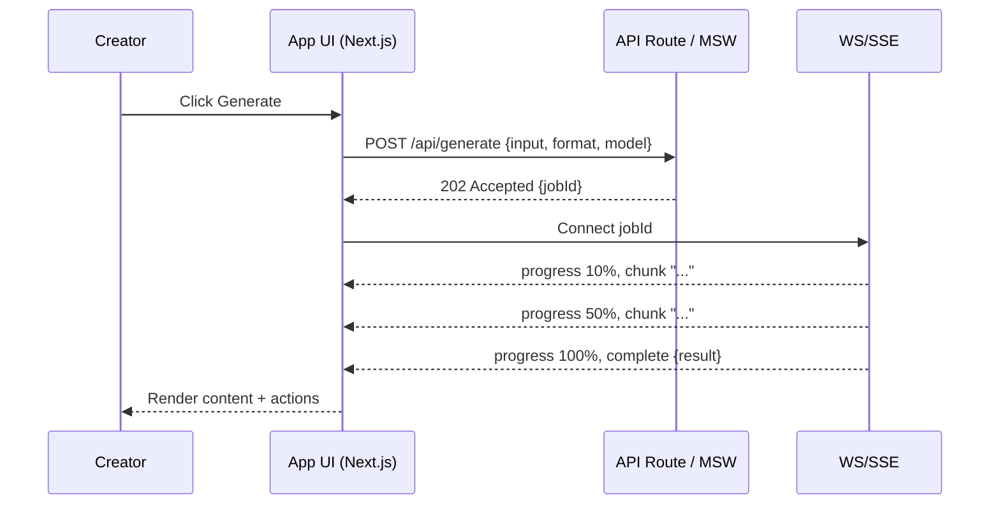

# Generation Flow & AI Gateway

This page summarizes the end-to-end generation flow and links to the API gateway specification and Storybook deep-dive diagrams.

## Sequence (Mermaid)

## References

- Storybook: Specs/AI/AI Gateway — Full Specification
- Storybook: Overview/Overview (Insanely Detailed)
- Live OpenAPI: /api/openapi.json (dev)
- Snapshot OpenAPI: /docs/api/openapi.snapshot.json
