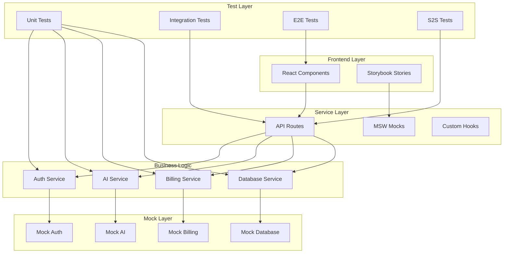

# 🎭 Mock-First Backend Architecture

## Philosophy: Build Everything Fake, Make It Real Later

> "If you can't mock it, you don't understand it well enough to build it."

## 🏗️ Architecture Overview



## 📦 Complete Backend Services to Mock

### 1. Authentication Service

```typescript
// src/services/auth/AuthService.ts
export interface AuthService {
  // User Management
  signUp(email: string, password: string): Promise<User>;
  signIn(email: string, password: string): Promise<Session>;
  signOut(): Promise<void>;

  // OAuth
  signInWithGoogle(): Promise<Session>;
  signInWithGitHub(): Promise<Session>;
  signInWithTwitter(): Promise<Session>;

  // Password Management
  resetPassword(email: string): Promise<void>;
  updatePassword(oldPassword: string, newPassword: string): Promise<void>;

  // Session Management
  getCurrentUser(): Promise<User | null>;
  refreshSession(): Promise<Session>;
  validateSession(token: string): Promise<boolean>;

  // Profile Management
  updateProfile(profile: UserProfile): Promise<User>;
  uploadAvatar(file: File): Promise<string>;
  deleteAccount(): Promise<void>;

  // MFA
  enableMFA(): Promise<MFASetup>;
  verifyMFA(code: string): Promise<boolean>;
  disableMFA(): Promise<void>;
}

// Mock implementation
export class MockAuthService implements AuthService {
  private users = new Map<string, User>();
  private sessions = new Map<string, Session>();
  private currentUser: User | null = null;

  async signUp(email: string, password: string) {
    const user = createMockUser({ email });
    this.users.set(email, user);
    return user;
  }

  // ... implement all methods with realistic delays and errors
}
```

### 2. Database Service

```typescript
// src/services/database/DatabaseService.ts
export interface DatabaseService {
  // User Data
  users: {
    create(data: CreateUserDTO): Promise<User>;
    findById(id: string): Promise<User | null>;
    findByEmail(email: string): Promise<User | null>;
    update(id: string, data: UpdateUserDTO): Promise<User>;
    delete(id: string): Promise<void>;
    list(filters: UserFilters): Promise<User[]>;
  };

  // Generations
  generations: {
    create(data: CreateGenerationDTO): Promise<Generation>;
    findById(id: string): Promise<Generation | null>;
    listByUser(userId: string): Promise<Generation[]>;
    update(id: string, data: UpdateGenerationDTO): Promise<Generation>;
    delete(id: string): Promise<void>;
    search(query: string): Promise<Generation[]>;
  };

  // API Keys
  apiKeys: {
    create(data: CreateAPIKeyDTO): Promise<APIKey>;
    findByUser(userId: string): Promise<APIKey[]>;
    validate(key: string): Promise<boolean>;
    revoke(id: string): Promise<void>;
    rotate(id: string): Promise<APIKey>;
  };

  // Usage Tracking
  usage: {
    track(event: UsageEvent): Promise<void>;
    getByUser(userId: string, range: DateRange): Promise<UsageStats>;
    getByProject(projectId: string): Promise<UsageStats>;
    aggregate(filters: UsageFilters): Promise<AggregatedStats>;
  };

  // Teams
  teams: {
    create(data: CreateTeamDTO): Promise<Team>;
    addMember(teamId: string, userId: string, role: Role): Promise<void>;
    removeMember(teamId: string, userId: string): Promise<void>;
    updateRole(teamId: string, userId: string, role: Role): Promise<void>;
    listByUser(userId: string): Promise<Team[]>;
  };
}

// Mock implementation with IndexedDB
export class MockDatabaseService implements DatabaseService {
  private db: IDBDatabase | null = null;

  async init() {
    this.db = await openDB("harvest-mock", 1, {
      upgrade(db) {
        db.createObjectStore("users", { keyPath: "id" });
        db.createObjectStore("generations", { keyPath: "id" });
        db.createObjectStore("apiKeys", { keyPath: "id" });
        db.createObjectStore("usage", { keyPath: "id" });
        db.createObjectStore("teams", { keyPath: "id" });
      },
    });
  }

  // Implement all methods with IndexedDB for persistence
}
```

### 3. AI Service

```typescript
// src/services/ai/AIService.ts
export interface AIService {
  // Generation
  generate(prompt: string, options: GenerationOptions): Promise<GenerationResult>;
  generateStream(prompt: string, options: GenerationOptions): AsyncGenerator<string>;

  // Templates
  generateFromTemplate(
    templateId: string,
    variables: Record<string, any>,
  ): Promise<GenerationResult>;

  // Providers
  listProviders(): Promise<AIProvider[]>;
  setProvider(provider: AIProvider): Promise<void>;
  testProvider(provider: AIProvider): Promise<boolean>;

  // Models
  listModels(provider: AIProvider): Promise<Model[]>;
  getModelInfo(modelId: string): Promise<ModelInfo>;

  // Cost Calculation
  estimateCost(prompt: string, model: string): Promise<CostEstimate>;
  calculateActualCost(usage: TokenUsage): Promise<number>;

  // History
  getHistory(userId: string): Promise<Generation[]>;
  regenerate(generationId: string): Promise<GenerationResult>;

  // Fine-tuning
  createFineTune(dataset: Dataset): Promise<FineTuneJob>;
  getFineTuneStatus(jobId: string): Promise<FineTuneStatus>;
  deployFineTune(jobId: string): Promise<Model>;
}

// Mock implementation with realistic responses
export class MockAIService implements AIService {
  private templates = new Map<string, Template>();
  private models = defaultModels;
  private currentProvider: AIProvider = "openai";

  async generate(prompt: string, options: GenerationOptions) {
    // Simulate processing time
    await delay(500 + Math.random() * 1500);

    // Generate realistic response based on prompt
    const response = this.generateMockResponse(prompt, options);

    // Track usage
    const usage = this.calculateTokenUsage(prompt, response);

    return {
      id: generateId(),
      prompt,
      response,
      usage,
      cost: this.calculateCost(usage),
      provider: this.currentProvider,
      model: options.model || "gpt-4",
      timestamp: new Date(),
    };
  }

  async *generateStream(prompt: string, options: GenerationOptions) {
    const response = this.generateMockResponse(prompt, options);
    const words = response.split(" ");

    for (const word of words) {
      await delay(50 + Math.random() * 100);
      yield word + " ";
    }
  }

  private generateMockResponse(prompt: string, options: GenerationOptions): string {
    // Smart mock responses based on prompt analysis
    if (prompt.includes("email")) {
      return this.generateMockEmail(prompt);
    }
    if (prompt.includes("blog")) {
      return this.generateMockBlogPost(prompt);
    }
    if (prompt.includes("code")) {
      return this.generateMockCode(prompt);
    }
    // ... more templates

    return this.generateGenericResponse(prompt);
  }
}
```

### 4. Billing Service

```typescript
// src/services/billing/BillingService.ts
export interface BillingService {
  // Subscriptions
  createSubscription(plan: Plan, paymentMethod: PaymentMethod): Promise<Subscription>;
  updateSubscription(subscriptionId: string, plan: Plan): Promise<Subscription>;
  cancelSubscription(subscriptionId: string): Promise<void>;
  getSubscription(userId: string): Promise<Subscription | null>;

  // Payment Methods
  addPaymentMethod(method: PaymentMethod): Promise<PaymentMethod>;
  removePaymentMethod(methodId: string): Promise<void>;
  setDefaultPaymentMethod(methodId: string): Promise<void>;
  listPaymentMethods(): Promise<PaymentMethod[]>;

  // Invoices
  getInvoices(userId: string): Promise<Invoice[]>;
  getInvoice(invoiceId: string): Promise<Invoice>;
  downloadInvoice(invoiceId: string): Promise<Blob>;

  // Usage-based Billing
  trackUsage(usage: UsageRecord): Promise<void>;
  getCurrentUsage(userId: string): Promise<UsageSummary>;
  getUsageHistory(userId: string, range: DateRange): Promise<UsageHistory>;

  // Credits
  addCredits(amount: number): Promise<CreditBalance>;
  useCredits(amount: number): Promise<CreditBalance>;
  getCreditBalance(): Promise<CreditBalance>;

  // Pricing
  getPricingPlans(): Promise<Plan[]>;
  calculateCost(usage: UsageEstimate): Promise<CostBreakdown>;
}

// Mock implementation
export class MockBillingService implements BillingService {
  private subscriptions = new Map<string, Subscription>();
  private paymentMethods = new Map<string, PaymentMethod[]>();
  private invoices = new Map<string, Invoice[]>();
  private credits = new Map<string, number>();

  async createSubscription(plan: Plan, paymentMethod: PaymentMethod) {
    const subscription = {
      id: generateId(),
      plan,
      status: "active" as const,
      currentPeriodStart: new Date(),
      currentPeriodEnd: addDays(new Date(), 30),
      paymentMethod,
      cancelAtPeriodEnd: false,
    };

    this.subscriptions.set(getCurrentUserId(), subscription);

    // Generate initial invoice
    await this.generateInvoice(subscription);

    return subscription;
  }

  // ... implement all methods with realistic business logic
}
```

### 5. Email Service

```typescript
// src/services/email/EmailService.ts
export interface EmailService {
  // Transactional
  sendWelcomeEmail(user: User): Promise<void>;
  sendPasswordReset(email: string, token: string): Promise<void>;
  sendEmailVerification(email: string, token: string): Promise<void>;
  sendInvoice(invoice: Invoice): Promise<void>;

  // Notifications
  sendUsageAlert(user: User, usage: UsageAlert): Promise<void>;
  sendTeamInvite(invite: TeamInvite): Promise<void>;
  sendGenerationComplete(generation: Generation): Promise<void>;

  // Marketing
  sendNewsletter(users: User[], content: NewsletterContent): Promise<void>;
  sendProductUpdate(users: User[], update: ProductUpdate): Promise<void>;

  // Templates
  createTemplate(template: EmailTemplate): Promise<EmailTemplate>;
  updateTemplate(id: string, template: EmailTemplate): Promise<EmailTemplate>;
  previewTemplate(id: string, data: Record<string, any>): Promise<string>;
}
```

### 6. Storage Service

```typescript
// src/services/storage/StorageService.ts
export interface StorageService {
  // File Operations
  upload(file: File, path: string): Promise<StorageObject>;
  download(path: string): Promise<Blob>;
  delete(path: string): Promise<void>;
  list(prefix: string): Promise<StorageObject[]>;

  // URLs
  getPublicUrl(path: string): Promise<string>;
  getSignedUrl(path: string, expires: number): Promise<string>;

  // Metadata
  getMetadata(path: string): Promise<ObjectMetadata>;
  updateMetadata(path: string, metadata: Partial<ObjectMetadata>): Promise<void>;

  // Buckets
  createBucket(name: string): Promise<Bucket>;
  deleteBucket(name: string): Promise<void>;
  listBuckets(): Promise<Bucket[]>;
}
```

### 7. Analytics Service

```typescript
// src/services/analytics/AnalyticsService.ts
export interface AnalyticsService {
  // Events
  track(event: string, properties?: Record<string, any>): Promise<void>;
  identify(userId: string, traits?: Record<string, any>): Promise<void>;
  page(name: string, properties?: Record<string, any>): Promise<void>;

  // Metrics
  increment(metric: string, value?: number): Promise<void>;
  gauge(metric: string, value: number): Promise<void>;
  timing(metric: string, duration: number): Promise<void>;

  // Funnels
  trackFunnelStep(funnel: string, step: string): Promise<void>;
  getFunnelConversion(funnel: string): Promise<FunnelStats>;

  // Dashboards
  getDashboard(id: string): Promise<Dashboard>;
  getMetrics(query: MetricsQuery): Promise<MetricsResult>;
}
```

## 🧪 Testing Strategy

### 1. Unit Tests for Each Service

```typescript
// src/services/auth/__tests__/AuthService.test.ts
describe("AuthService", () => {
  let service: AuthService;

  beforeEach(() => {
    service = new MockAuthService();
  });

  describe("signUp", () => {
    it("should create a new user", async () => {
      const user = await service.signUp("test@example.com", "password123");
      expect(user.email).toBe("test@example.com");
      expect(user.id).toBeDefined();
    });

    it("should hash passwords", async () => {
      const user = await service.signUp("test@example.com", "password123");
      expect(user.passwordHash).not.toBe("password123");
    });

    it("should prevent duplicate emails", async () => {
      await service.signUp("test@example.com", "password123");
      await expect(service.signUp("test@example.com", "password456")).rejects.toThrow(
        "Email already exists",
      );
    });

    it("should validate email format", async () => {
      await expect(service.signUp("invalid-email", "password123")).rejects.toThrow(
        "Invalid email format",
      );
    });

    it("should enforce password requirements", async () => {
      await expect(service.signUp("test@example.com", "123")).rejects.toThrow(
        "Password must be at least 8 characters",
      );
    });
  });

  // ... test all methods
});
```

### 2. Integration Tests for API Routes

```typescript
// src/app/api/auth/__tests__/route.test.ts
describe("Auth API Routes", () => {
  describe("POST /api/auth/signup", () => {
    it("should create user and return session", async () => {
      const response = await fetch("/api/auth/signup", {
        method: "POST",
        body: JSON.stringify({
          email: "test@example.com",
          password: "password123",
        }),
      });

      expect(response.status).toBe(201);
      const data = await response.json();
      expect(data.user).toBeDefined();
      expect(data.session).toBeDefined();
    });

    it("should handle validation errors", async () => {
      const response = await fetch("/api/auth/signup", {
        method: "POST",
        body: JSON.stringify({
          email: "invalid",
          password: "123",
        }),
      });

      expect(response.status).toBe(400);
      const data = await response.json();
      expect(data.errors).toContain("Invalid email format");
      expect(data.errors).toContain("Password too short");
    });
  });
});
```

### 3. E2E Tests for User Journeys

```typescript
// e2e/auth-journey.spec.ts
test.describe("Authentication Journey", () => {
  test("new user signup flow", async ({ page }) => {
    // 1. Visit landing page
    await page.goto("/");

    // 2. Click sign up
    await page.click("text=Sign Up");

    // 3. Fill form
    await page.fill("[name=email]", "test@example.com");
    await page.fill("[name=password]", "password123");
    await page.fill("[name=confirmPassword]", "password123");

    // 4. Submit
    await page.click("button[type=submit]");

    // 5. Verify redirect to dashboard
    await expect(page).toHaveURL("/dashboard");

    // 6. Verify welcome message
    await expect(page.locator("text=Welcome to Harvest")).toBeVisible();

    // 7. Verify user menu
    await page.click("[data-testid=user-menu]");
    await expect(page.locator("text=test@example.com")).toBeVisible();
  });

  test("password reset flow", async ({ page }) => {
    // ... complete flow
  });

  test("OAuth login flow", async ({ page }) => {
    // ... complete flow
  });
});
```

### 4. S2S (Server-to-Server) Tests

```typescript
// tests/s2s/api-integration.test.ts
describe("S2S API Integration", () => {
  let apiKey: string;

  beforeAll(async () => {
    // Create API key
    const response = await fetch("/api/keys/create", {
      method: "POST",
      headers: {
        Authorization: "Bearer test-token",
      },
    });
    const data = await response.json();
    apiKey = data.key;
  });

  test("should handle generation requests", async () => {
    const response = await fetch("/api/v1/generate", {
      method: "POST",
      headers: {
        "X-API-Key": apiKey,
        "Content-Type": "application/json",
      },
      body: JSON.stringify({
        prompt: "Write a haiku about testing",
        model: "gpt-4",
        stream: false,
      }),
    });

    expect(response.status).toBe(200);
    const data = await response.json();
    expect(data.response).toBeDefined();
    expect(data.usage.tokens).toBeGreaterThan(0);
  });

  test("should handle streaming requests", async () => {
    const response = await fetch("/api/v1/generate", {
      method: "POST",
      headers: {
        "X-API-Key": apiKey,
        "Content-Type": "application/json",
        "Accept": "text/event-stream",
      },
      body: JSON.stringify({
        prompt: "Write a story",
        stream: true,
      }),
    });

    expect(response.headers.get("content-type")).toContain("text/event-stream");

    const reader = response.body.getReader();
    const chunks = [];

    while (true) {
      const { done, value } = await reader.read();
      if (done) break;
      chunks.push(new TextDecoder().decode(value));
    }

    expect(chunks.length).toBeGreaterThan(0);
  });

  test("should enforce rate limits", async () => {
    // Make requests up to limit
    for (let i = 0; i < 100; i++) {
      await fetch("/api/v1/generate", {
        method: "POST",
        headers: { "X-API-Key": apiKey },
        body: JSON.stringify({ prompt: "test" }),
      });
    }

    // Next request should be rate limited
    const response = await fetch("/api/v1/generate", {
      method: "POST",
      headers: { "X-API-Key": apiKey },
      body: JSON.stringify({ prompt: "test" }),
    });

    expect(response.status).toBe(429);
    expect(response.headers.get("X-RateLimit-Remaining")).toBe("0");
  });
});
```

## 📚 Storybook Stories for Backend

### 1. Service Playground Stories

```typescript
// src/stories/backend/AuthService.stories.tsx
export default {
  title: 'Backend/Auth Service',
  component: AuthServicePlayground,
}

export const SignUpFlow = () => {
  const [result, setResult] = useState(null)
  const service = useMockAuthService()

  const handleSignUp = async (data) => {
    try {
      const user = await service.signUp(data.email, data.password)
      setResult({ success: true, user })
    } catch (error) {
      setResult({ success: false, error: error.message })
    }
  }

  return (
    <div className="p-8">
      <h2>Auth Service - Sign Up</h2>
      <SignUpForm onSubmit={handleSignUp} />
      {result && <ResultDisplay result={result} />}
    </div>
  )
}

export const SessionManagement = () => {
  // Interactive session management
}

export const OAuthProviders = () => {
  // OAuth flow visualization
}
```

### 2. Database Visualizer

```typescript
// src/stories/backend/DatabaseViewer.stories.tsx
export const DatabaseExplorer = () => {
  const db = useMockDatabase()
  const [selectedTable, setSelectedTable] = useState('users')
  const [data, setData] = useState([])

  useEffect(() => {
    db[selectedTable].list().then(setData)
  }, [selectedTable])

  return (
    <div className="flex h-screen">
      <Sidebar>
        {Object.keys(db).map(table => (
          <TableItem
            key={table}
            name={table}
            count={data.length}
            onClick={() => setSelectedTable(table)}
          />
        ))}
      </Sidebar>
      <MainContent>
        <DataTable data={data} />
        <QueryBuilder table={selectedTable} />
      </MainContent>
    </div>
  )
}
```

### 3. API Testing Console

```typescript
// src/stories/backend/APIConsole.stories.tsx
export const APITestingConsole = () => {
  return (
    <div className="min-h-screen bg-gray-900 text-white">
      <RequestBuilder />
      <ResponseViewer />
      <HistoryPanel />
      <SavedRequests />
    </div>
  )
}
```

## 🎯 Implementation Order

### Phase 1: Core Services (Week 1)

1. **Auth Service** - Complete mock implementation
2. **Database Service** - IndexedDB persistence
3. **Storybook Stories** - Interactive playgrounds
4. **Unit Tests** - 100% coverage

### Phase 2: Business Logic (Week 2)

1. **AI Service** - Smart mock responses
2. **Billing Service** - Subscription logic
3. **Integration Tests** - API routes
4. **E2E Tests** - User journeys

### Phase 3: Supporting Services (Week 3)

1. **Email Service** - Template system
2. **Storage Service** - File handling
3. **Analytics Service** - Event tracking
4. **S2S Tests** - API integration

### Phase 4: Polish & Connect (Week 4)

1. **Error Handling** - Comprehensive errors
2. **Performance** - Optimization
3. **Documentation** - Complete guides
4. **Real Services** - Start connecting

## 🎨 Template System

### Email Templates

```typescript
const templates = {
  welcome: {
    subject: "Welcome to {{company}}!",
    html: `<h1>Welcome {{name}}!</h1>...`,
    text: "Welcome {{name}}!...",
  },
  passwordReset: {
    subject: "Reset your password",
    html: `<a href="{{resetUrl}}">Reset Password</a>`,
    text: "Reset your password: {{resetUrl}}",
  },
  invoice: {
    subject: "Invoice #{{invoiceNumber}}",
    html: invoiceTemplate,
    attachments: ["invoice.pdf"],
  },
};
```

### Generation Templates

```typescript
const generationTemplates = {
  email: {
    professional: "Write a professional email about {{topic}}...",
    casual: "Write a casual email about {{topic}}...",
    followUp: "Write a follow-up email regarding {{previousTopic}}...",
  },
  blog: {
    technical: "Write a technical blog post about {{technology}}...",
    tutorial: "Create a step-by-step tutorial for {{task}}...",
    listicle: "Write a listicle about {{number}} ways to {{action}}...",
  },
  code: {
    function: "Write a {{language}} function that {{description}}...",
    class: "Create a {{language}} class for {{purpose}}...",
    test: "Write unit tests for {{codeSnippet}}...",
  },
};
```

### Response Templates

```typescript
const responseTemplates = {
  success: {
    created: { status: 201, message: "{{resource}} created successfully" },
    updated: { status: 200, message: "{{resource}} updated successfully" },
    deleted: { status: 200, message: "{{resource}} deleted successfully" },
  },
  error: {
    validation: { status: 400, message: "Validation failed", errors: [] },
    unauthorized: { status: 401, message: "Authentication required" },
    forbidden: { status: 403, message: "Access denied" },
    notFound: { status: 404, message: "{{resource}} not found" },
    rateLimit: { status: 429, message: "Rate limit exceeded" },
  },
};
```

## 🚀 Benefits of This Approach

1. **Complete Understanding** - You understand the entire system before building
2. **Perfect Tests** - Tests are written against stable mocks
3. **Parallel Development** - Frontend and backend can work independently
4. **Documentation** - Storybook becomes living documentation
5. **Quality Assurance** - Everything is tested before going live
6. **Risk Reduction** - Identify issues before expensive implementations
7. **Faster Iteration** - Change mocks quickly without breaking things

## 🎯 Next Steps

```bash
# 1. Create service structure
mkdir -p src/services/{auth,database,ai,billing,email,storage,analytics}

# 2. Create mock implementations
touch src/services/auth/MockAuthService.ts
touch src/services/database/MockDatabaseService.ts

# 3. Create Storybook stories
touch src/stories/backend/AuthService.stories.tsx
touch src/stories/backend/DatabaseViewer.stories.tsx

# 4. Write tests first
touch src/services/auth/__tests__/AuthService.test.ts

# 5. Build the mocks
npm run dev
```

**This is the way!** Build everything fake, test it thoroughly, then make it real. 🚀
