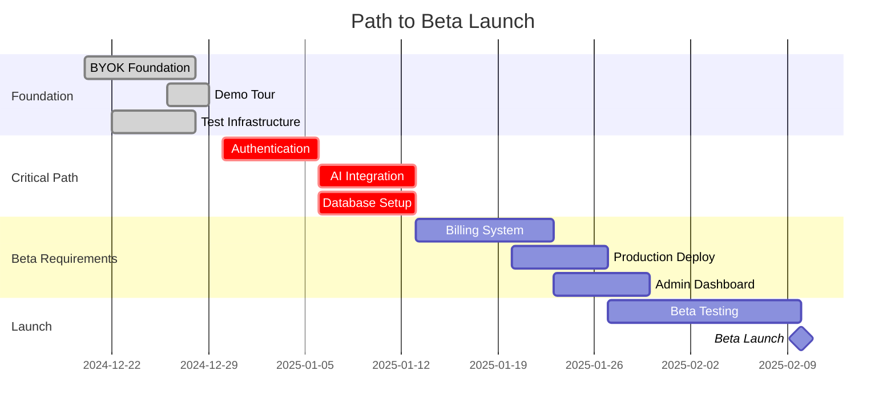

# 🚀 Beta Roadmap - Path to Production

## 📊 Current State Summary

### 2025-08-30: Test & Stability Update

- All Jest unit/integration suites pass locally (229/229)
- UI animation warnings removed in test runs (motion prop stripping)
- Deterministic UI tests for demo tour and status monitor
- API client test harness hardened (abort/timeouts, globalThis.fetch)
- E2E (Playwright) scope to be reviewed post-auth/db integration

### ✅ What's Complete

#### **EPIC-001: BYOK Foundation** (100% Complete)

- ✅ Core BYOK implementation with TypeScript
- ✅ Session management with automatic expiry
- ✅ 6 AI provider support (OpenAI, Anthropic, Google, Azure, Cohere, Hugging Face)
- ✅ Zero-storage security architecture
- ✅ Interactive demo mode with tour
- ✅ 42/42 unit tests passing
- ✅ Full Storybook documentation

#### **EPIC-BYOK-001: Demo Tour** (100% Complete)

- ✅ Floating action button with animations
- ✅ 7-step interactive tour
- ✅ First-time visitor auto-start
- ✅ System status monitoring
- ✅ Performance tracking hook
- ✅ Complete E2E test suite
- ✅ Integration tests
- ✅ Comprehensive Storybook stories

#### **Test Infrastructure** (100% Complete)

- ✅ Jest configuration
- ✅ Playwright E2E setup
- ✅ MSW mocks for offline development
- ✅ Test utilities and factories
- ✅ Centralized selectors
- ✅ Coverage tracking

### ⚠️ What's Partially Complete

#### **Content Generation** (60% Complete)

- ✅ AI Service class implemented
- ✅ Mock providers configured
- ⚠️ Streaming tests needed
- ⚠️ Error handling incomplete
- ❌ Real AI provider integration pending

#### **Documentation** (80% Complete)

- ✅ Storybook running with 20+ stories
- ✅ TDD Master Plan documented
- ✅ API documentation (OpenAPI pending)
- ⚠️ Some MDX stories have indexer warnings
- ❌ User guides not written

### ❌ What's Missing for Beta

#### **Critical Infrastructure**

- ❌ NO Database (Supabase configured but not connected)
- ❌ NO Authentication (Zero implementation)
- ❌ NO Real AI Integration (Mock only)
- ❌ NO Payment System (Stripe not configured)
- ❌ NO Production Deployment

## 🎯 Beta Requirements

### Beta Readiness Analysis (2025-08-30)

Readiness drivers:

- Engineering stability: ✅ Local unit/integration tests fully green
- Documentation: ✅ Extensive docs and Storybook; will add Beta-specific onboarding
- Critical features: ❌ Auth, ❌ DB persistence, ❌ Real AI, ❌ Billing still pending (see below)
- Security/Monitoring: ⚠️ Production posture not yet in place (CSP, Sentry, uptime)

Decision: Not Beta-ready until EPIC-002 (Auth), EPIC-003 (Real AI), EPIC-004 (DB) are completed. Testing foundation is strong enough to proceed aggressively once features land.

Go/No-Go gates:

- Go when all must-have items in "Definition of Beta Ready" are satisfied and smoke/E2E passes with real backends enabled
- No-Go if any of: auth data leakage, model API errors >1%, failing payments path, or unrecoverable provider errors without fallback

### Minimum Viable Beta (MVB)

To reach beta, we need:

1. **Working product** with real AI generation
2. **User accounts** with authentication
3. **Data persistence** for user content
4. **Basic monetization** (usage limits or payments)
5. **Production deployment** with monitoring

## 📅 Epic Roadmap to Beta

### 🔥 EPIC-002: Authentication & User System

**Priority: P0 - BLOCKER**  
**Timeline: 1 week**  
**Status: Not Started**

#### Deliverables:

- [ ] Supabase Auth integration
- [ ] Login/Signup flows
- [ ] Password reset
- [ ] OAuth providers (Google, GitHub)
- [ ] Protected routes
- [ ] User profile management
- [ ] Session handling

#### Success Metrics:

- 100% test coverage for auth flows
- <2s login time
- OAuth working for 2+ providers
- Secure session management

---

### 🔥 EPIC-003: Real AI Integration (Deferred for Mock-Beta)

**Priority: Deferred to Post-Beta**  
**Timeline: N/A (post-beta)**  
**Status: Deferred**

For Mock-Beta we operate exclusively with MSW-backed mocks and Storybook demo flows. Real provider integrations will land post-beta.

#### Deliverables:

- [ ] OpenAI API integration
- [ ] Anthropic Claude integration
- [ ] Google Gemini integration
- [ ] Provider fallback chain
- [ ] Streaming responses
- [ ] Error handling & retries
- [ ] Cost tracking per request

#### Success Metrics:

- 3+ providers working
- <500ms time to first token
- 99% uptime with fallbacks
- Accurate cost tracking

---

### 🔥 EPIC-004: Database & Persistence (Deferred for Mock-Beta)

**Priority: Deferred to Post-Beta**  
**Timeline: N/A (post-beta)**  
**Status: Deferred**

Mock-Beta uses in-memory/mocked persistence; no production DB required.

#### Deliverables:

- [ ] Supabase PostgreSQL setup
- [ ] User data schema
- [ ] Generation history
- [ ] API key storage (encrypted)
- [ ] Usage tracking
- [ ] Rate limit persistence
- [ ] Session storage

#### Success Metrics:

- Zero data loss
- <100ms query time
- Encrypted sensitive data
- GDPR compliant

---

### 💰 EPIC-005: Billing & Monetization (Removed for Mock-Beta)

This epic is out of scope for Mock-Beta and will be reconsidered later.

#### Deliverables:

- [ ] Stripe integration
- [ ] Subscription plans
- [ ] Usage-based billing
- [ ] Free tier limits
- [ ] Payment flows
- [ ] Invoice generation
- [ ] Usage dashboards

#### Success Metrics:

- Payment success rate >95%
- Clear pricing display
- Usage tracking accuracy
- Subscription management working

---

### 🚀 EPIC-006: Public Mock-Beta Deployment

**Priority: P0 for Mock-Beta**  
**Timeline: 1 week**  
**Status: Planned**

Deliverables:

- [ ] Vercel deployment (mock mode defaults)
- [ ] Environment configuration for mock toggles (NEXT_PUBLIC_ENABLE_MSW=1)
- [ ] CI “test:all” with Playwright using dev:mock
- [ ] Basic uptime check and error boundary UX

Success Metrics:

- Stable UI render and flows under MSW
- E2E green in mock mode across Chromium (optionally Firefox/WebKit)
- No console errors in primary journeys

#### Deliverables:

- [ ] Vercel deployment
- [ ] Environment configuration
- [ ] CI/CD pipeline
- [ ] SSL certificates
- [ ] CDN setup
- [ ] Error monitoring (Sentry)
- [ ] Analytics (PostHog)
- [ ] Performance monitoring

#### Success Metrics:

- 99.9% uptime
- <200ms response time
- Global CDN active
- Zero security vulnerabilities

---

### 📊 EPIC-007: Admin Dashboard

**Priority: P2 - Nice to Have**  
**Timeline: 1 week**  
**Status: Not Started**

#### Deliverables:

- [ ] User management
- [ ] Usage analytics
- [ ] System health monitoring
- [ ] Content moderation
- [ ] Support ticket system
- [ ] Feature flags
- [ ] A/B testing framework

---

## 📈 Timeline to Beta



## 🎯 Sprint Plan

### Sprint 1 (Dec 30 - Jan 5): Authentication Foundation

**Goal**: Complete user system

- Week focus: Supabase Auth + protected routes
- Target: 100% auth test coverage
- Deliverable: Working login/signup

### Sprint 2 (Jan 6 - Jan 12): AI + Database

**Goal**: Real AI working with persistence

- Week focus: Connect OpenAI + PostgreSQL
- Target: First real generation saved to DB
- Deliverable: Working AI with history

### Sprint 3 (Jan 13 - Jan 19): Monetization

**Goal**: Payment system operational

- Week focus: Stripe + usage limits
- Target: First successful payment
- Deliverable: Working subscriptions

### Sprint 4 (Jan 20 - Jan 26): Production Ready

**Goal**: Deploy to production

- Week focus: Deployment + monitoring
- Target: Live beta URL
- Deliverable: harvest.ai live

### Sprint 5 (Jan 27 - Feb 2): Beta Testing

**Goal**: Private beta with real users

- Week focus: Bug fixes + polish
- Target: 50 beta users
- Deliverable: Stable beta

### Sprint 6 (Feb 3 - Feb 9): Beta Launch

**Goal**: Public beta announcement

- Week focus: Marketing + onboarding
- Target: 500 users
- Deliverable: Public beta

## 🚦 Risk Assessment

### 🔴 High Risk (Blockers)

1. **No Authentication** - Can't have users without auth
2. **No Database** - Can't persist anything
3. **No Real AI** - Core value prop missing
4. **No Payments** - Can't monetize

### 🟡 Medium Risk

1. **Performance at scale** - Untested
2. **Security vulnerabilities** - No audit yet
3. **Provider costs** - Unknown burn rate
4. **User experience** - Needs polish

### 🟢 Low Risk

1. **UI/UX** - Already looks good
2. **Documentation** - Comprehensive
3. **Testing** - Good foundation
4. **Architecture** - Well structured

## 📊 Success Metrics for Beta

### Technical Metrics

- [ ] 99.9% uptime
- [ ] <500ms response time
- [ ] Zero critical bugs
- [ ] 80% test coverage

### Business Metrics

- [ ] 500 beta users
- [ ] 50% weekly active users
- [ ] 10% paid conversion
- [ ] <$0.10 per generation cost

### User Metrics

- [ ] <90s time to first output
- [ ] 80% task completion rate
- [ ] 4+ star average rating
- [ ] <5% support ticket rate

## 🎬 Current Sprint Actions

### This Week (Dec 30 - Jan 5)

1. **Monday**: Set up Supabase Auth
2. **Tuesday**: Create login/signup components
3. **Wednesday**: Implement protected routes
4. **Thursday**: Add OAuth providers
5. **Friday**: Testing & documentation

### Immediate TODOs:

```bash
# 1. Set up Supabase project
npm install @supabase/supabase-js @supabase/auth-helpers-nextjs

# 2. Create auth context
touch src/contexts/AuthContext.tsx

# 3. Build auth pages
touch src/app/(auth)/login/page.tsx
touch src/app/(auth)/signup/page.tsx

# 4. Write auth tests first (TDD)
touch src/__tests__/auth.test.tsx
```

## 🏁 Definition of Mock-Beta Ready

### Must Have ✅

- [ ] All Jest unit/integration tests green (done)
- [ ] Playwright E2E green in mock mode (dev:mock) for core flows
- [ ] UI renders end-to-end demo journeys without errors
- [ ] Deployed public mock-beta URL (Vercel)
- [ ] Clear “Mock Beta” labeling (no real backend calls)

### Should Have 🎯

- [ ] Minimal uptime check and error boundary UX
- [ ] Basic system status page describing mock mode

### Nice to Have 💫

- [ ] Visual snapshot baselines captured for primary views
- [ ] A11y smoke (axe) clean for core pages

### Should Have 🎯

- [ ] 3+ AI providers integrated
- [ ] Email notifications work
- [ ] Admin can view metrics
- [ ] A/B testing framework
- [ ] Feature flags system

### Nice to Have 💫

- [ ] Mobile app
- [ ] Team collaboration
- [ ] API documentation
- [ ] Affiliate program
- [ ] White-label options

## 📢 Beta Announcement Plan

### Week -2: Private Alpha

- 10 hand-picked users
- Direct feedback channel
- Daily bug fixes

### Week -1: Closed Beta

- 50 invited users
- Discord community
- Feedback surveys

### Week 0: Public Beta

- ProductHunt launch
- HackerNews post
- Twitter announcement
- Blog post

### Week +1: Iterate

- Fix critical bugs
- Implement top requests
- Optimize performance
- Plan v1.0

---

## 🎯 The Bottom Line

**Current State**: Beautiful frontend with zero backend  
**Beta Requirements**: Auth + AI + Database + Payments + Deployment  
**Timeline**: 6 weeks (realistic), 4 weeks (aggressive)  
**Next Epic**: EPIC-002 Authentication (START IMMEDIATELY)

**Critical Path**:

1. Auth (Week 1) - Can't do anything without users
2. AI + DB (Week 2) - Core functionality
3. Payments (Week 3) - Business model
4. Deploy (Week 4) - Go live
5. Test (Week 5) - Polish
6. Launch (Week 6) - 🚀

---

_Last Updated: 2024-12-29_  
_Next Review: Daily standup_  
_Beta Target: February 10, 2025_
