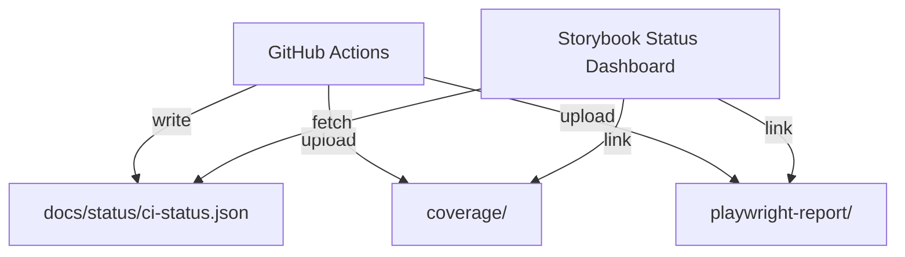

# System Status Aggregator & Polling

This page documents how CI writes the status JSON and how the Storybook dashboard consumes it. It also outlines optional polling/refresh strategies when needed.

## Data flow



## JSON schema (example)

```json
{
  "summary": {
    "unit": "passed | failed | partial",
    "e2e": "passed | failed | partial",
    "storybookInteractions": "passed | failed | partial"
  },
  "links": {
    "coverage": "./coverage/index.html",
    "playwrightReport": "./playwright-report/index.html"
  },
  "generatedAt": "<run-id or timestamp>"
}
```

## Refresh & polling

- Static Storybook typically loads a single snapshot. If you serve Storybook from a static host and want fresher data:
  - Option A: Rebuild and redeploy Storybook when CI finishes (simple, most common)
  - Option B: Add client polling to the dashboard every N minutes, guarded by a feature flag (only if your host allows live JSON updates)
- Current setup: The dashboard fetches once on load and renders badges/links.

## References

- Storybook: Specs/System Status — Full Spec
- Storybook: Docs/Status Dashboard
- CI workflow: .github/workflows/ci.yml
