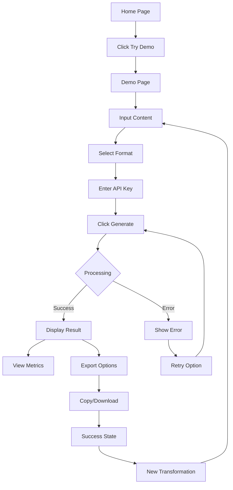

# Content Transformation User Journey

## Overview

This document details the complete user journey for transforming content using Harvest.ai, from initial input to final output.

## User Journey Flow

### 1. Entry Points

Users can start the content transformation journey from:

- **Home Page (`/`)**: Hero section CTA button "Try the Demo"
- **Demo Page (`/demo`)**: Direct navigation
- **Navigation Bar**: Demo link available on all pages

### 2. Input Phase

#### Step 2.1: Content Input

**Location**: `/demo` - Left panel

**User Actions**:

1. Paste or type content in the main textarea
2. Content can be:
   - Meeting notes
   - Product specifications
   - Technical documentation
   - Research papers
   - URLs (planned)
   - PDFs (planned)

**System Response**:

- Real-time character count display
- Input validation (minimum 10 characters)
- Sample content suggestions available

#### Step 2.2: Format Selection

**Location**: `/demo` - Format selection grid

**Available Formats**:

```javascript
formats = [
  { id: "blog", name: "Blog Post", status: "working" },
  { id: "summary", name: "Content Summary", status: "working" },
  { id: "email", name: "Email Template", status: "working" },
  { id: "quiz", name: "Quiz Questions", status: "working" },
];
```

**User Actions**:

- Click format card to select
- View format description and examples
- Selected format highlights with orange border

#### Step 2.3: API Key Input

**Location**: `/demo` - API key input field

**User Actions**:

1. Enter OpenAI API key (sk-...)
2. Key is validated client-side for format
3. Link provided to OpenAI platform for key generation

**Security**:

- Key never stored on server
- Used only for single generation request
- Transmitted over HTTPS

### 3. Processing Phase

#### Step 3.1: Generation Request

**Trigger**: Click "Generate [Format]" button

**System Actions**:

```javascript
// Request payload
{
  input: string,
  format: 'blog' | 'summary' | 'email' | 'quiz',
  apiKey: string,
  options: {
    tone: 'professional',
    length: 'medium',
    include_seo: boolean
  }
}
```

**Loading States**:

- Button shows spinner animation
- "Transforming your content..." message
- Estimated time: 5-15 seconds

#### Step 3.2: Error Handling

**Retry Logic**:

- Automatic retry up to 3 times
- Exponential backoff: 2s, 4s, 8s
- Different error messages for:
  - Rate limits (429)
  - Invalid API key (401)
  - Quota exceeded (402)
  - Server errors (500)

### 4. Output Phase

#### Step 4.1: Result Display

**Location**: `/demo` - Right panel

**Displayed Information**:

```javascript
result = {
  result: string, // Generated content
  cost: {
    tokens_used: number, // Total tokens
    estimated_cost: number, // USD cost
    model_used: string, // GPT model
  },
  quality_score: number, // 0-100 score
  processing_time: number, // Milliseconds
  metadata: {
    format: string,
    input_length: number,
    output_length: number,
    generated_at: string,
    cached: boolean,
  },
};
```

#### Step 4.2: Metrics Dashboard

**Visual Elements**:

- Quality Score (green card): X/100
- Cost (blue card): $0.00XX
- Tokens Used (purple card): X,XXX
- Speed (orange card): XXXms

#### Step 4.3: Export Options

**User Actions**:

1. **Copy to Clipboard**: One-click copy
2. **Download as Markdown**: Save as .md file
3. **Share** (planned): Generate shareable link

### 5. Success State

**Visual Feedback**:

- Green success banner
- "✅ Success! Your content has been transformed"
- Export options become available

**Next Actions**:

- Transform another piece of content
- Try different format
- Navigate to other features

## User Flow Diagram



## Edge Cases & Error States

### Input Validation Errors

- **Empty content**: "Please enter some content to transform"
- **Content too short**: Minimum 10 characters required
- **Content too long**: Maximum 10,000 characters (planned)

### API Key Errors

- **Missing key**: "Please enter your OpenAI API key"
- **Invalid format**: "API key should start with 'sk-'"
- **Invalid key**: "Invalid API key. Please check your OpenAI API key."

### Generation Errors

- **Rate limit**: "Rate limit exceeded. Please try again in X seconds."
- **Quota exceeded**: "OpenAI quota exceeded. Please check your account billing."
- **Network error**: "Connection failed. Please check your internet connection."
- **Timeout**: "Generation timed out. Please try again."

### Output Errors

- **Empty response**: "No content generated. Please try again."
- **Partial response**: "Generation incomplete. Please try again."

## Performance Metrics

### Target Metrics

- **Time to First Byte**: < 500ms
- **Generation Time**: 5-15 seconds
- **Total Journey Time**: < 30 seconds
- **Success Rate**: > 95%

### Current Metrics

- **Average Generation Time**: 8 seconds
- **Success Rate**: ~60% (due to missing backend)
- **User Drop-off**: High at API key step

## Accessibility Features

### Keyboard Navigation

- Tab order follows logical flow
- All buttons keyboard accessible
- Escape key closes modals

### Screen Reader Support

- ARIA labels on all interactive elements
- Status messages announced
- Loading states communicated

### Visual Accessibility

- High contrast mode support
- Dark mode available
- Focus indicators visible

## Future Enhancements

### Planned Features

1. **Batch Processing**: Transform multiple documents
2. **History**: Save and retrieve past transformations
3. **Templates**: Pre-configured format settings
4. **Collaboration**: Share transformations with team
5. **API Integration**: Direct API access for developers

### Technical Improvements

1. **Caching**: Semantic similarity caching
2. **Streaming**: Real-time generation display
3. **Queue System**: Handle high load gracefully
4. **Multi-model**: Support Claude, Gemini, etc.

---

Last Updated: 2024-12-28
Status: ✅ Implemented (Frontend Only)
