# 🚀 Harvest.ai User Journeys & Flows

## Table of Contents

1. [Authentication Journeys](#authentication-journeys)
2. [Content Generation Journeys](#content-generation-journeys)
3. [Team Collaboration Journeys](#team-collaboration-journeys)
4. [Subscription Management](#subscription-management)
5. [API Integration Journey](#api-integration-journey)
6. [Error Recovery Flows](#error-recovery-flows)

---

## Authentication Journeys

### 🔐 New User Registration Flow

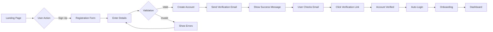

#### Steps:

1. **Landing** - User arrives at harvest.ai
2. **Sign Up Click** - User clicks "Get Started" or "Sign Up"
3. **Form Entry** - User enters:
   - Email address
   - Password (min 8 chars, 1 number, 1 special)
   - Name (optional)
   - Marketing consent (checkbox)
4. **Validation** - Real-time validation:
   - Email format check
   - Password strength meter
   - Duplicate email check
5. **Account Creation** - Backend processing:
   - Create user record
   - Generate verification token
   - Send welcome email
6. **Email Verification** - User action:
   - Check inbox
   - Click verification link
   - Auto-redirect to app
7. **Onboarding** - First-time setup:
   - Choose use case
   - Set preferences
   - Skip or complete profile

### 🔑 Returning User Login Flow

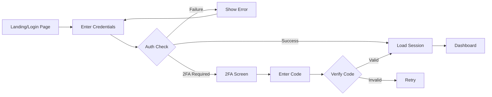

### 🔄 Password Reset Flow

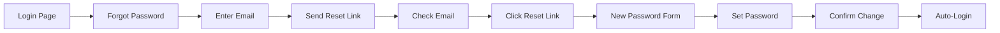

### 🔗 Social Authentication Flow

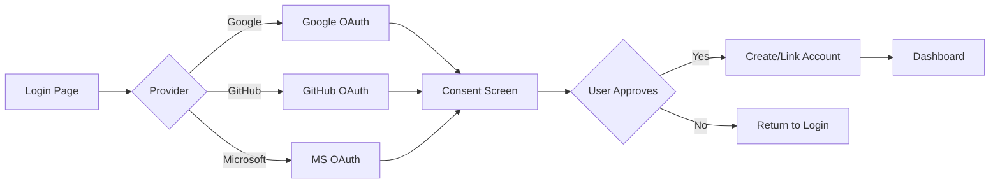

---

## Content Generation Journeys

### 📝 Basic Content Generation Flow

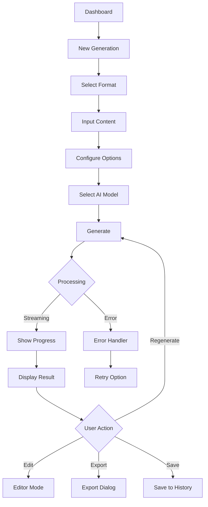

#### Detailed Steps:

1. **Format Selection**
   - Blog Post
   - Email
   - Summary
   - Quiz
   - Presentation
   - Social Media
   - Custom

2. **Content Input**
   - Paste text
   - Upload file
   - Enter URL
   - Voice input
   - Import from history

3. **Configuration Options**
   - Tone: Professional/Casual/Formal/Creative
   - Length: Short/Medium/Long/Custom
   - Language: 50+ languages
   - Style: Informative/Persuasive/Narrative
   - Audience: General/Technical/Academic

4. **AI Model Selection**
   - GPT-4 (Advanced)
   - GPT-3.5 (Fast)
   - Claude 3 Opus (Creative)
   - Claude 3 Sonnet (Balanced)

5. **Generation Process**
   - Show loading spinner
   - Stream partial results
   - Display word count
   - Show estimated time

6. **Result Actions**
   - Edit in place
   - Copy to clipboard
   - Download file
   - Share link
   - Save to templates

### 🔄 Batch Generation Flow

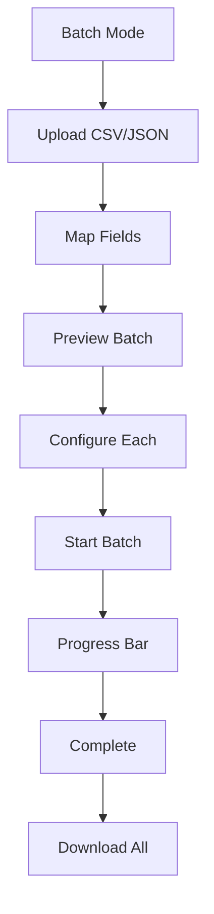

### 📚 Template Usage Flow

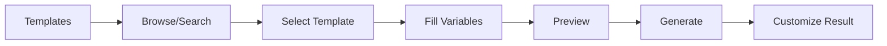

---

## Team Collaboration Journeys

### 👥 Team Creation Flow

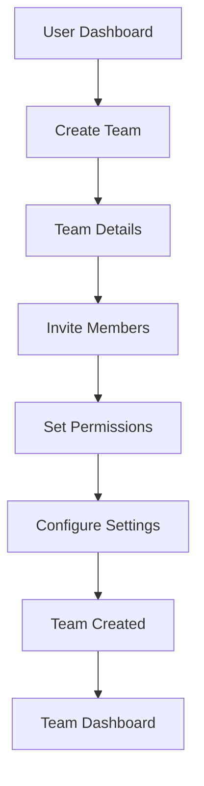

#### Permission Levels:

- **Owner** - Full control
- **Admin** - Manage team, content
- **Editor** - Create, edit content
- **Viewer** - Read-only access

### 🤝 Member Invitation Flow

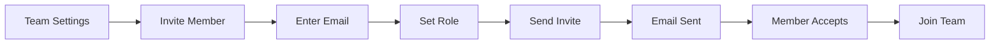

### 📊 Shared Content Flow

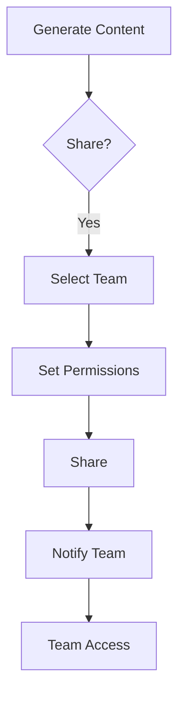

---

## Subscription Management

### 💳 Upgrade to Pro Flow

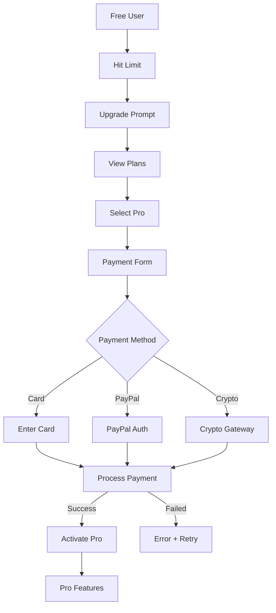

### 📊 Usage Monitoring Flow

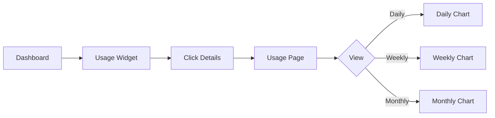

### 🔄 Plan Management Flow

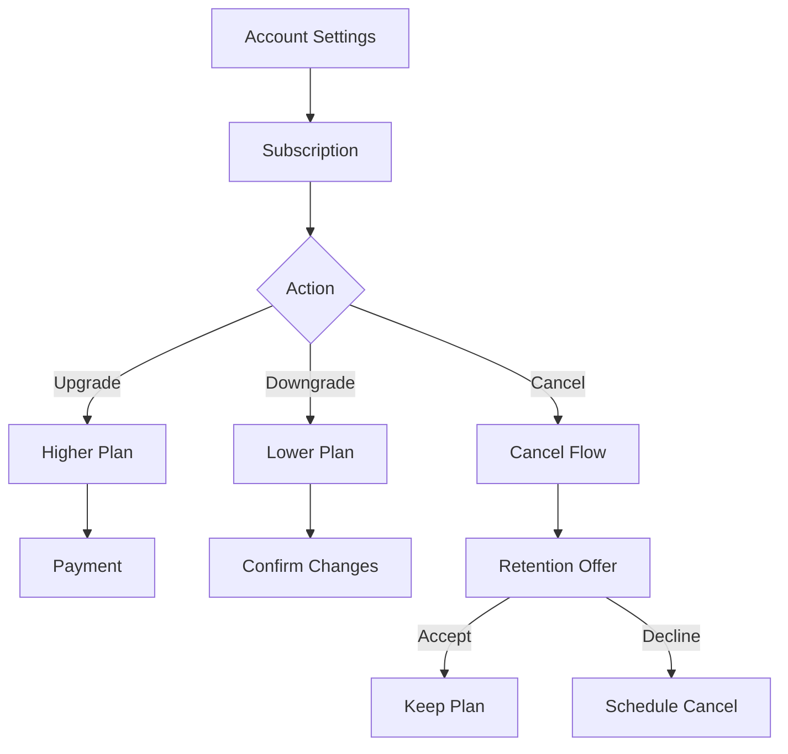

---

## API Integration Journey

### 🔌 API Key Generation Flow

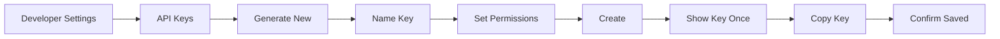

### 🚀 API Usage Flow

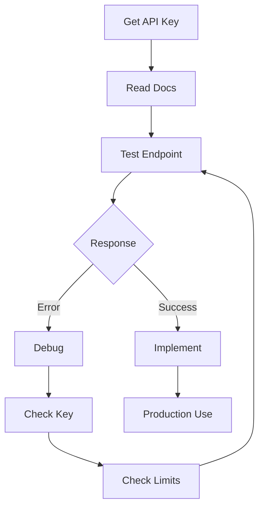

### 📈 API Monitoring Flow

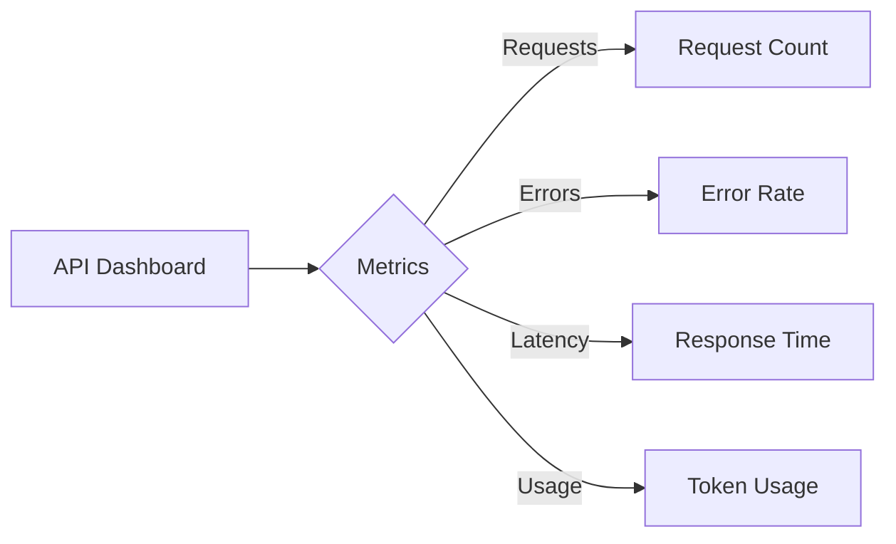

---

## Error Recovery Flows

### ⚠️ Generation Error Recovery

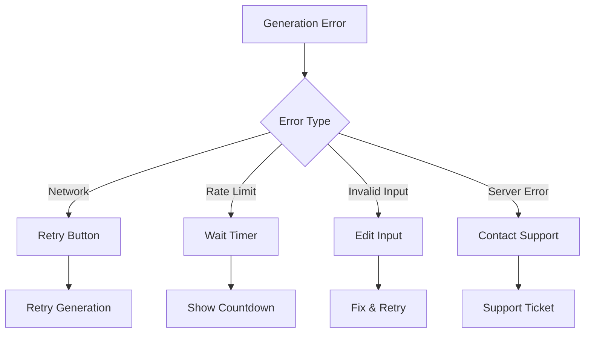

### 🔧 Payment Error Recovery

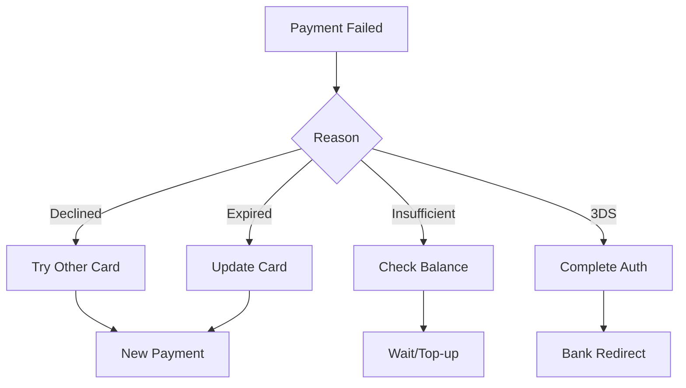

### 🔄 Session Recovery Flow

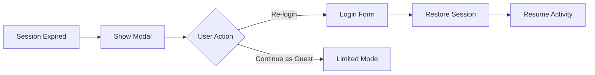

---

## User State Transitions

### 📊 User Lifecycle States

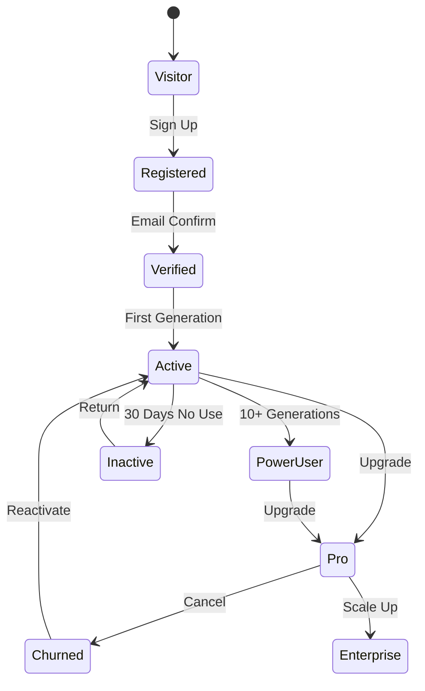

### 🎯 Feature Discovery Flow

```mermaid
graph TB
    A[New User] --> B[Basic Features]
    B --> C{Usage}
    C -->|Low| D[Show Tips]
    C -->|Medium| E[Suggest Features]
    C -->|High| F[Advanced Tools]
    D --> G[Onboarding Tours]
    E --> H[Feature Highlights]
    F --> I[Pro Upsell]
```

---

## Mobile-Specific Flows

### 📱 Mobile Generation Flow

```mermaid
graph TB
    A[Mobile Home] --> B[Quick Action]
    B --> C{Input Method}
    C -->|Voice| D[Record Audio]
    C -->|Camera| E[Scan Text]
    C -->|Type| F[Mobile Keyboard]
    D --> G[Process]
    E --> G
    F --> G
    G --> H[Generate]
    H --> I[Mobile View]
    I --> J{Action}
    J -->|Share| K[Share Sheet]
    J -->|Save| L[Local Storage]
```

### 📲 Mobile Authentication

```mermaid
graph LR
    A[App Launch] --> B{Biometric?}
    B -->|Available| C[FaceID/TouchID]
    B -->|Not Available| D[PIN/Password]
    C --> E[Authenticate]
    D --> E
    E -->|Success| F[App Home]
    E -->|Fail| G[Retry]
```

---

## Analytics & Tracking Events

### 📈 Key User Events

| Event                | Category      | Properties                  | Purpose           |
| -------------------- | ------------- | --------------------------- | ----------------- |
| page_view            | Navigation    | page_name, referrer         | Track navigation  |
| sign_up_started      | Auth          | source, method              | Conversion funnel |
| sign_up_completed    | Auth          | user_id, method             | Success rate      |
| generation_started   | Content       | format, model, length       | Usage patterns    |
| generation_completed | Content       | format, model, time, tokens | Performance       |
| generation_failed    | Content       | error_type, format          | Error tracking    |
| payment_initiated    | Revenue       | plan, amount                | Revenue tracking  |
| payment_completed    | Revenue       | plan, amount, method        | Revenue           |
| feature_discovered   | Engagement    | feature_name                | Feature adoption  |
| team_created         | Collaboration | team_size                   | Team usage        |
| api_key_created      | Developer     | permissions                 | API adoption      |

---

## Accessibility Flows

### ♿ Screen Reader Flow

```mermaid
graph TB
    A[Page Load] --> B[Announce Title]
    B --> C[Focus Main]
    C --> D[Tab Navigation]
    D --> E[Read Labels]
    E --> F[Announce Actions]
    F --> G[Confirm Results]
```

### ⌨️ Keyboard Navigation Flow

```mermaid
graph LR
    A[Tab Key] --> B[Focus Next]
    B --> C[Show Outline]
    C --> D[Enter/Space]
    D --> E[Activate]
    E --> F[Announce Change]
```

---

## Performance Optimization Flows

### ⚡ Lazy Loading Flow

```mermaid
graph TB
    A[Initial Load] --> B[Critical CSS/JS]
    B --> C[Render Shell]
    C --> D[Load Above Fold]
    D --> E[User Scrolls]
    E --> F[Load Next Section]
    F --> G[Prefetch Links]
```

### 🔄 Cache Strategy Flow

```mermaid
graph LR
    A[Request] --> B{In Cache?}
    B -->|Yes| C{Fresh?}
    B -->|No| D[Fetch]
    C -->|Yes| E[Return Cache]
    C -->|No| F[Revalidate]
    D --> G[Update Cache]
    F --> G
    G --> H[Return Data]
```

---

## Security Flows

### 🔐 2FA Setup Flow

```mermaid
graph TB
    A[Security Settings] --> B[Enable 2FA]
    B --> C[Choose Method]
    C --> D{Method}
    D -->|App| E[QR Code]
    D -->|SMS| F[Phone Number]
    D -->|Email| G[Email Confirm]
    E --> H[Scan with App]
    F --> I[Send Code]
    G --> I
    H --> J[Enter Code]
    I --> J
    J --> K[Verify]
    K --> L[Backup Codes]
    L --> M[2FA Active]
```

### 🛡️ Security Challenge Flow

```mermaid
graph TB
    A[Suspicious Activity] --> B[Challenge User]
    B --> C{Challenge Type}
    C -->|CAPTCHA| D[Solve CAPTCHA]
    C -->|Email Code| E[Send Email]
    C -->|Security Question| F[Answer Question]
    D --> G{Verify}
    E --> H[Enter Code]
    F --> G
    H --> G
    G -->|Pass| I[Allow Access]
    G -->|Fail| J[Block + Log]
```

---

## Support & Help Flows

### 💬 Help System Flow

```mermaid
graph TB
    A[User Stuck] --> B[Help Button]
    B --> C{Help Type}
    C -->|Contextual| D[Tooltip]
    C -->|Guide| E[Tutorial]
    C -->|Search| F[Help Center]
    C -->|Contact| G[Support Form]
    D --> H[Quick Fix]
    E --> I[Step-by-Step]
    F --> J[Article]
    G --> K[Ticket Created]
```

### 🎯 Onboarding Tutorial Flow

```mermaid
graph LR
    A[First Login] --> B[Welcome Modal]
    B --> C[Feature Tour]
    C --> D[Interactive Demo]
    D --> E[First Task]
    E --> F[Celebrate Success]
    F --> G[Next Steps]
```

---

## Data Management Flows

### 💾 Export Data Flow

```mermaid
graph TB
    A[Account Settings] --> B[Export Data]
    B --> C[Select Data Type]
    C --> D{Format}
    D -->|JSON| E[Generate JSON]
    D -->|CSV| F[Generate CSV]
    D -->|PDF| G[Generate PDF]
    E --> H[Prepare File]
    F --> H
    G --> H
    H --> I[Send Email]
    I --> J[Download Link]
```

### 🗑️ Account Deletion Flow

```mermaid
graph TB
    A[Account Settings] --> B[Delete Account]
    B --> C[Confirm Reason]
    C --> D[Final Warning]
    D --> E[Enter Password]
    E --> F[Process Deletion]
    F --> G[Export Option]
    G --> H[Schedule Deletion]
    H --> I[Grace Period]
    I --> J[Permanent Delete]
```

---

## Integration Flows

### 🔗 Third-Party Integration Setup

```mermaid
graph TB
    A[Integrations Page] --> B[Select Service]
    B --> C{Service}
    C -->|Slack| D[OAuth Flow]
    C -->|Zapier| E[API Key]
    C -->|Webhooks| F[URL Config]
    D --> G[Authorize]
    E --> H[Enter Key]
    F --> I[Test Webhook]
    G --> J[Connected]
    H --> J
    I --> J
```

### 📤 Content Publishing Flow

```mermaid
graph LR
    A[Generated Content] --> B[Publish]
    B --> C{Platform}
    C -->|WordPress| D[WP API]
    C -->|Medium| E[Medium API]
    C -->|LinkedIn| F[LinkedIn API]
    D --> G[Published]
    E --> G
    F --> G
    G --> H[Share Link]
```

---

## Administrative Flows

### 👨‍💼 Admin Dashboard Flow

```mermaid
graph TB
    A[Admin Login] --> B[Dashboard]
    B --> C{Section}
    C -->|Users| D[User Management]
    C -->|Content| E[Content Moderation]
    C -->|Analytics| F[System Analytics]
    C -->|Settings| G[System Config]
    D --> H[User Actions]
    E --> I[Content Actions]
    F --> J[Reports]
    G --> K[Update Settings]
```

### 🔍 Content Moderation Flow

```mermaid
graph TB
    A[Flagged Content] --> B[Review Queue]
    B --> C[Moderator Review]
    C --> D{Decision}
    D -->|Approve| E[Unflag]
    D -->|Reject| F[Remove]
    D -->|Edit| G[Suggest Changes]
    E --> H[Notify User]
    F --> H
    G --> H
```

---

## Testing & QA Flows

### 🧪 A/B Testing Flow

```mermaid
graph TB
    A[User Arrives] --> B{Experiment Running?}
    B -->|Yes| C[Assign Variant]
    B -->|No| D[Default Experience]
    C --> E{Variant}
    E -->|A| F[Control]
    E -->|B| G[Treatment]
    F --> H[Track Metrics]
    G --> H
    H --> I[Analyze Results]
```

### 🐛 Bug Report Flow

```mermaid
graph TB
    A[User Encounters Bug] --> B[Report Bug]
    B --> C[Capture Context]
    C --> D[Fill Form]
    D --> E[Attach Screenshot]
    E --> F[Submit]
    F --> G[Create Ticket]
    G --> H[Notify Team]
    H --> I[Investigate]
    I --> J[Fix & Deploy]
    J --> K[Notify User]
```

---

## Conclusion

These user journeys represent the complete interaction patterns within Harvest.ai. Each flow has been designed with:

- **User Experience** - Intuitive and efficient
- **Error Handling** - Graceful recovery
- **Performance** - Optimized loading
- **Accessibility** - Inclusive design
- **Security** - Protected at every step
- **Analytics** - Tracked for insights

Regular updates to these flows ensure they remain aligned with user needs and business goals.
