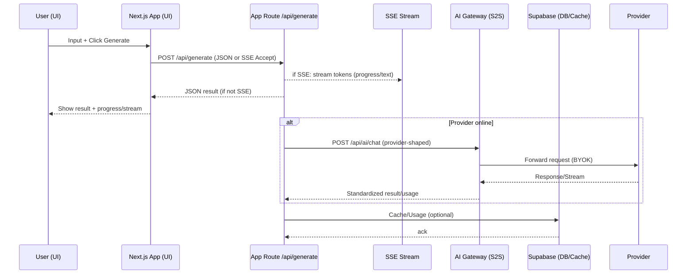

import { Meta } from "@storybook/addon-docs/blocks";

export const parameters = { layout: "fullscreen" };

# First Interaction → Journey → S2S Guided Tour

Follow this guided sequence to understand the entire flow from the first UI interaction through user journeys and into server‑to‑server (S2S) patterns.

<Meta title="Labs/First Interaction → Journey → S2S Guided Tour" />

## 1) First Interaction (UI → API)
- UI: Content generator panel
  - Where: `src/components/content/ContentGenerator.tsx`
- API: Generate route (JSON + SSE)
  - Where: `src/app/api/generate/route.ts`
- Try it in Storybook:
  - Docs → Tech Stack & API Playground (POST /api/generate; use TRIGGER_RATE_LIMIT / TRIGGER_ERROR)
- Try it live:
  - App → /demo (progress + streaming text)

## 2) User Story Mapping
- Story: “As a user, I can transform content into a professional format.”
  - UI: ContentGenerator
  - API: /api/generate
  - Mocks: `src/mocks/handlers/generation.ts` (TRIGGER_* cases)
  - Tests: `tests/e2e/content-generation.spec.ts`, `tests/e2e/demo.spec.ts`
  - Docs: `docs/architecture/GENERATION_FLOW.md`
- See also (docs in Storybook):
  - Labs → Technology Overview Lab → User stories → technology mapping

## 3) Streaming (SSE) and Fallbacks
- In‑app SSE client
  - Where: `src/app/playground/sse/page.tsx`
- Helpers: `src/lib/client/sseParser.ts`, `src/lib/client/useSSEStream.ts`
- Try it in Storybook:
  - Docs → Playgrounds (SSE client, latency/error profiles)
- Tests: `tests/e2e/generate-stream.spec.ts`, `tests/e2e/threads-stream.spec.ts`

## 4) S2S (Server‑to‑Server) Concepts
- BYOK AI Gateway (frontend perspective)
  - API: `src/app/api/ai/chat/route.ts` (provider shapes)
  - Hook: `src/hooks/useAIChat.ts` (stream support)
- Storybook S2S labs:
  - S2SStreaming, S2SRecipes, S2SReference, S2S‑Journeys (Extended)
- Docs for deeper context:
  - `docs/runbooks/OPERATIONS_BOOK.md`
  - `docs/architecture/MOCK_FIRST_BACKEND.md`
  - `docs/S2S_STORIES.md`

## 5) Observability & Status
- System status (reality): `docs/SYSTEM_STATUS.md`
  - Storybook: Docs → System Status
- CI aggregator (if present): `docs/status/ci-status.json`
  - Storybook: Docs → Status Dashboard

## 6) Epics & DevLog (always up‑to‑date in SB)
- Epics source: `docs/roadmap/EPICS.md`
  - Storybook: Command Center → Epics Manager (canonical)
- DevLog source: `docs/status/DEVLOG.md`
  - Storybook: Command Center → Devlog (canonical)

## 7) Security & Config
- Security headers: `next.config.mjs` (HSTS, CSP, COOP/COEP)
  - Storybook: Docs → SecurityTrustPlan
- Remote config: Docs → RemoteConfig

## High‑level flow (Mermaid)

## Quick links (open these in the Storybook search if links don’t resolve)
- Labs/Technology Overview Lab
- Docs/Tech Stack & API Playground
- Docs/Playgrounds
- Docs/System Status, Docs/Status Dashboard
- Command Center/Epics Manager (canonical)
- Command Center/Devlog
- S2SStreaming, S2SRecipes, S2SReference, S2S‑Journeys (Extended)

