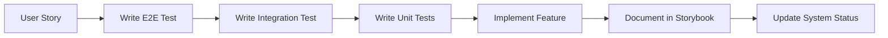

import { Meta } from "@storybook/addon-docs";

<Meta title="Docs/🎓 Expert Hub - Master Harvest.ai" />

# 🎓 Expert Hub - Become a Harvest.ai Expert

> **Your complete learning path** from beginner to expert. Follow this guide to master every aspect of Harvest.ai.

## 📚 Learning Paths

### Path 1: Developer Onboarding (2-3 days)

<div
  style={{
    background: "linear-gradient(135deg, #667eea 0%, #764ba2 100%)",
    padding: "20px",
    borderRadius: "12px",
    color: "white",
    marginBottom: "20px",
  }}
>
  <h3>Week 1: Foundation</h3>
  <ul>
    <li>✅ Read System Architecture</li>
    <li>✅ Setup Local Development</li>
    <li>✅ Run Tests & Storybook</li>
    <li>✅ Understand TDD Workflow</li>
  </ul>
</div>

#### Day 1: System Understanding

1. **Start Here**: [System Status](?path=/docs/docs-system-status--docs) - Current reality
2. **Architecture**: [Technical Stack](?path=/docs/docs-tech-stack--docs) - Technologies used
3. **Vision**: [Product Brief](?path=/docs/specs-product-brief--docs) - What we're building
4. **Roadmap**: [Epics & Tasks](?path=/docs/command-center-epics-board--docs) - What's planned

#### Day 2: Development Setup

1. **Environment**: [Local Dev Guide](?path=/docs/docs-local-dev-guide--docs)
2. **Testing**: [TDD Master Plan](?path=/docs/docs-tdd-master-plan--docs)
3. **Patterns**: [Testing Patterns](?path=/docs/docs-testing-patterns-examples--docs)
4. **Mocking**: [Mock Strategy](?path=/docs/playground-api-playground--docs)

#### Day 3: Hands-On Practice

1. **Run Tests**: `npm test` - See current state
2. **Start Storybook**: `npm run storybook` - Explore components
3. **Try Demo**: `npm run dev:mock` - Use the app
4. **Make Changes**: Pick a small bug and fix it with TDD

### Path 2: Feature Developer (1 week)

<div
  style={{
    background: "linear-gradient(135deg, #f093fb 0%, #f5576c 100%)",
    padding: "20px",
    borderRadius: "12px",
    color: "white",
    marginBottom: "20px",
  }}
>
  <h3>Week 2: Building Features</h3>
  <ul>
    <li>📝 Write failing tests first</li>
    <li>🔨 Implement minimal solution</li>
    <li>♻️ Refactor for quality</li>
    <li>📚 Document in Storybook</li>
  </ul>
</div>

#### Core Features to Master

1. **Content Generation**: [AI Service](?path=/docs/specs-ai-gateway--docs)
2. **Authentication**: [Auth Flow](?path=/docs/specs-authentication--docs)
3. **BYOK System**: [API Keys](?path=/docs/features-byok--docs)
4. **Templates**: [Crisis Mode](?path=/docs/features-panic-mode--docs)

#### Implementation Process



### Path 3: System Expert (2 weeks)

<div
  style={{
    background: "linear-gradient(135deg, #4facfe 0%, #00f2fe 100%)",
    padding: "20px",
    borderRadius: "12px",
    color: "white",
    marginBottom: "20px",
  }}
>
  <h3>Weeks 3-4: Deep Expertise</h3>
  <ul>
    <li>🏗️ Architecture decisions</li>
    <li>🔍 Performance optimization</li>
    <li>🛡️ Security hardening</li>
    <li>📊 Observability setup</li>
  </ul>
</div>

## 🗺️ System Map

### Frontend Architecture

```
src/
├── app/              # Next.js pages & API routes
│   ├── api/         # Backend endpoints
│   └── (pages)/     # UI pages
├── components/       # React components
├── lib/             # Core libraries
│   ├── ai/         # AI service layer
│   ├── auth/       # Authentication
│   └── db/         # Database layer
├── stories/         # Storybook docs
└── tests/           # Test suites
```

### Key Technologies

| Layer    | Technology        | Purpose            | Docs                                                                 |
| -------- | ----------------- | ------------------ | -------------------------------------------------------------------- |
| Frontend | Next.js 14        | React framework    | [Setup Guide](?path=/docs/docs-local-dev-guide--docs)                |
| UI       | Tailwind CSS      | Styling            | [Component Stories](?path=/story/components-layout--default)         |
| Testing  | Jest + Playwright | Test coverage      | [Testing Patterns](?path=/docs/docs-testing-patterns-examples--docs) |
| Mocking  | MSW               | API mocking        | [Mock Strategy](?path=/docs/playground-api-playground--docs)         |
| State    | React Query       | Server state       | [Data Fetching](?path=/docs/patterns-data-fetching--docs)            |
| Backend  | Supabase          | Database & Auth    | [Backend Setup](?path=/docs/specs-system-status--docs)               |
| AI       | OpenAI/Anthropic  | Content generation | [AI Service](?path=/docs/specs-ai-gateway--docs)                     |

## 🎯 Core Concepts

### 1. Test-Driven Development (TDD)

Every feature follows the Red-Green-Refactor cycle:

```typescript
// 1. RED - Write failing test
test("should generate blog post", async () => {
  const result = await generateContent("input", "blog");
  expect(result).toHaveProperty("content");
});

// 2. GREEN - Make it pass
async function generateContent(input, format) {
  return { content: "Generated blog post" };
}

// 3. REFACTOR - Improve quality
async function generateContent(input: string, format: Format) {
  const service = new AIService();
  return service.generate({ input, format });
}
```

### 2. Mock-First Development

We build with mocks first, then replace with real implementations:

```typescript
// Start with mock
const mockGenerate = jest.fn().mockResolvedValue({
  content: "Mocked content",
});

// Later, real implementation
const realGenerate = async (input) => {
  const response = await openai.complete(input);
  return response;
};
```

### 3. Component-Driven Development

Build UI in isolation using Storybook:

```typescript
// Component story
export const Default = {
  args: {
    user: { name: "John", plan: "pro" },
  },
};

export const Loading = {
  args: {
    loading: true,
  },
};
```

## 📖 Essential Documentation

### Must-Read Documents

1. **[System Status](?path=/docs/docs-system-status--docs)** - What actually works
2. **[TDD Master Plan](?path=/docs/docs-tdd-master-plan--docs)** - How we build
3. **[API Specification](?path=/docs/specs-api-specification--docs)** - Backend contracts
4. **[Testing Patterns](?path=/docs/docs-testing-patterns-examples--docs)** - Test examples
5. **[Product Brief](?path=/docs/specs-product-brief--docs)** - Product vision

### Interactive Playgrounds

- **[API Playground](?path=/docs/playground-api-playground--docs)** - Try API calls
- **[SSE Streaming Demo](?path=/docs/playground-sse-streaming--docs)** - Real-time updates
- **[Component Explorer](?path=/story/components-contentgenerator--default)** - UI components
- **[Dev Tools](?path=/docs/dev-tools--docs)** - Development utilities

## 🛠️ Development Workflow

### Daily Development Cycle

```bash
# 1. Start your day
git pull origin main
npm install
npm test                    # Verify tests pass

# 2. Pick a task
npm run storybook           # Review requirements

# 3. Write tests first
npm test -- --watch         # TDD mode

# 4. Implement feature
npm run dev:mock            # Development with mocks

# 5. Document
# Update Storybook stories

# 6. Submit PR
npm run test:all            # Full test suite
npm run build               # Verify build
```

### Common Commands

| Command                 | Purpose                | When to Use       |
| ----------------------- | ---------------------- | ----------------- |
| `npm run dev:mock`      | Development with mocks | Local development |
| `npm test`              | Run unit tests         | Before commits    |
| `npm run test:e2e`      | Run E2E tests          | Before PR         |
| `npm run storybook`     | Component docs         | Documentation     |
| `npm run test:coverage` | Coverage report        | Weekly check      |

## 🎓 Advanced Topics

### Performance Optimization

```typescript
// Use React.memo for expensive components
const ExpensiveComponent = React.memo(({ data }) => {
  return <ComplexVisualization data={data} />;
});

// Lazy load heavy features
const AIService = lazy(() => import('./ai/service'));
```

### Security Best Practices

```typescript
// Never expose keys client-side
const API_KEY = process.env.OPENAI_API_KEY; // ❌ Bad

// Use server-side API routes
export async function POST(req) {
  const key = process.env.OPENAI_API_KEY; // ✅ Good
  // ... use key server-side only
}
```

### Observability Setup

```typescript
// Add metrics to critical paths
async function generateContent(input) {
  const start = Date.now();

  try {
    const result = await aiService.generate(input);
    metrics.record("generation.success", Date.now() - start);
    return result;
  } catch (error) {
    metrics.record("generation.error", { error: error.code });
    throw error;
  }
}
```

## 🚀 Next Steps

### For New Developers

1. Complete the onboarding path
2. Fix one failing test
3. Add one new test
4. Document one component

### For Contributors

1. Pick an issue from GitHub
2. Write tests first
3. Implement solution
4. Update documentation

### For Experts

1. Review architecture decisions
2. Optimize performance bottlenecks
3. Improve test coverage
4. Mentor new developers

## 📊 Progress Tracking

### Your Learning Checklist

- [ ] Read all essential documentation
- [ ] Set up local development
- [ ] Run all test suites
- [ ] Explore Storybook stories
- [ ] Fix one bug with TDD
- [ ] Add one feature with tests
- [ ] Document one component
- [ ] Review one PR
- [ ] Optimize one performance issue
- [ ] Mentor one developer

## 🎯 Mastery Indicators

You're an expert when you can:

1. **Explain** the system architecture to others
2. **Debug** issues without guidance
3. **Write** tests before implementation
4. **Review** PRs effectively
5. **Optimize** performance bottlenecks
6. **Document** features comprehensively
7. **Mentor** new developers
8. **Make** architectural decisions
9. **Deploy** to production confidently
10. **Handle** incidents independently

## 🏆 Certification Path

### Level 1: Contributor

- Fixed 5 bugs
- Added 10 tests
- Documented 3 components

### Level 2: Developer

- Implemented 3 features
- 90% test coverage on code
- Reviewed 10 PRs

### Level 3: Expert

- Led 1 major feature
- Mentored 3 developers
- Optimized 5 performance issues

## 📚 Additional Resources

### Internal Resources

- [Roadmap & Epics](?path=/docs/command-center-epics-board--docs)
- [System Metrics](?path=/docs/command-center-test-coverage--docs)
- [Dev Tools](?path=/docs/dev-tools--docs)

### External Resources

- [Next.js Documentation](https://nextjs.org/docs)
- [React Testing Library](https://testing-library.com/react)
- [Playwright Guide](https://playwright.dev)
- [Tailwind CSS](https://tailwindcss.com)

---

> 💡 **Remember**: The journey to expertise is incremental. Master one concept at a time, and always write tests first!
