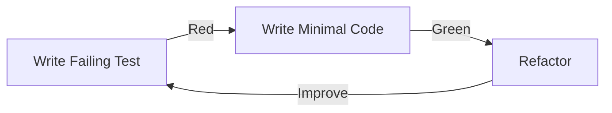

import { Meta } from "@storybook/addon-docs";

<Meta title="Docs/TDD Master Plan" />

# Test-Driven Development Master Plan

> 🎯 **Goal**: Make Harvest.ai a fully tested, production-ready system where every feature is born from a failing test.

## 🧪 TDD Philosophy

### The Red-Green-Refactor Cycle



### Our Testing Pyramid

```
         /\
        /E2E\       <- User journeys, critical paths (10%)
       /------\
      /Integration\ <- API contracts, component integration (30%)
     /------------\
    /Unit Tests    \ <- Business logic, utilities, components (60%)
   /________________\
```

## 📊 Current State vs Target

| Metric             | Current | Target | Gap      |
| ------------------ | ------- | ------ | -------- |
| Unit Test Coverage | 82.8%   | 95%    | 🔴 12.2% |
| E2E Tests Passing  | Unknown | 100%   | 🔴       |
| API Tests          | 0%      | 100%   | 🔴 100%  |
| Component Stories  | 60%     | 100%   | 🟡 40%   |
| Documentation      | 40%     | 100%   | 🟡 60%   |

## 🎬 Test Categories & Patterns

### 1. Unit Tests

**Location**: `__tests__/unit/`
**Pattern**: AAA (Arrange, Act, Assert)

```typescript
describe("AIService", () => {
  it("should fallback to secondary provider on primary failure", async () => {
    // Arrange
    const service = new AIService();
    mockOpenAI.mockRejectedValue(new Error("Rate limited"));

    // Act
    const result = await service.generate({ prompt: "test" });

    // Assert
    expect(result.provider).toBe("anthropic");
    expect(mockAnthropic).toHaveBeenCalled();
  });
});
```

### 2. Integration Tests

**Location**: `__tests__/integration/`
**Pattern**: Given-When-Then

```typescript
describe("Content Generation Flow", () => {
  it("should generate content with caching", async () => {
    // Given
    const user = await createTestUser();
    const input = createTestInput();

    // When
    const firstResponse = await api.post("/api/generate", input);
    const secondResponse = await api.post("/api/generate", input);

    // Then
    expect(firstResponse.headers["x-cache"]).toBe("miss");
    expect(secondResponse.headers["x-cache"]).toBe("hit");
  });
});
```

### 3. E2E Tests

**Location**: `tests/e2e/`
**Pattern**: User Journey

```typescript
test("Crisis Mode Content Generation", async ({ page }) => {
  // User arrives in panic
  await page.goto("/panic");

  // Selects emergency template
  await page.click('[data-testid="template-crisis-statement"]');

  // Fills minimal info
  await page.fill('[data-testid="crisis-input"]', "Product recall");

  // Generates content
  await page.click('[data-testid="generate-now"]');

  // Verifies quick response
  await expect(page.locator('[data-testid="generated-content"]')).toBeVisible({ timeout: 5000 });
});
```

## 🚀 Implementation Phases

### Phase 1: Foundation (Week 1)

- [ ] Set up test infrastructure
- [ ] Create test utilities and helpers
- [ ] Write failing tests for core features
- [ ] Fix critical E2E test selectors

### Phase 2: Core Features (Week 2)

- [ ] Authentication with TDD
- [ ] Content generation with TDD
- [ ] BYOK implementation with TDD
- [ ] Template system with TDD

### Phase 3: Advanced Features (Week 3)

- [ ] Caching layer with tests
- [ ] Rate limiting with tests
- [ ] Observability with tests
- [ ] Team collaboration with tests

### Phase 4: Polish & Documentation (Week 4)

- [ ] Visual regression tests
- [ ] Performance tests
- [ ] Security tests
- [ ] Complete documentation

## 📚 Test Documentation Structure

### For Each Feature:

1. **Specification** (Storybook MDX)
2. **Test Plan** (What to test)
3. **Test Cases** (Specific scenarios)
4. **Test Implementation** (Actual tests)
5. **Coverage Report** (Metrics)

### Example: Authentication Feature

```
/stories/specs/Authentication.stories.mdx     <- Specification
/docs/testing/auth-test-plan.md              <- Test Plan
/__tests__/unit/auth/                        <- Unit tests
/__tests__/integration/auth/                 <- Integration tests
/tests/e2e/auth.spec.ts                      <- E2E tests
```

## 🎯 Test Quality Metrics

### What Makes a Good Test?

1. **Fast** - Runs in milliseconds (unit) to seconds (E2E)
2. **Isolated** - No dependencies on other tests
3. **Repeatable** - Same result every time
4. **Self-validating** - Clear pass/fail
5. **Timely** - Written before the code

### Anti-patterns to Avoid

❌ Testing implementation details
❌ Brittle selectors (`.css-x7z8`)
❌ Hard-coded waits (`sleep(5000)`)
❌ Testing external services directly
❌ Shared test state

## 🔧 Test Utilities & Helpers

### Custom Test Utilities

```typescript
// test-utils/factories.ts
export const createTestUser = (overrides = {}) => ({
  id: "test-user-123",
  email: "test@example.com",
  apiKeys: [],
  ...overrides,
});

// test-utils/api.ts
export const authenticatedRequest = async (endpoint, options = {}) => {
  const token = await getTestToken();
  return fetch(endpoint, {
    ...options,
    headers: {
      Authorization: `Bearer ${token}`,
      ...options.headers,
    },
  });
};
```

### MSW Mock Handlers

```typescript
// mocks/handlers/test-handlers.ts
export const testHandlers = [
  rest.post("/api/generate", (req, res, ctx) => {
    // Predictable test responses
    return res(
      ctx.json({
        content: "Test generated content",
        id: "test-generation-123",
      }),
    );
  }),
];
```

## 📈 Coverage Goals & Tracking

### Coverage Targets by Area

| Area             | Target | Priority    |
| ---------------- | ------ | ----------- |
| API Routes       | 100%   | 🔴 Critical |
| Business Logic   | 95%    | 🔴 Critical |
| UI Components    | 90%    | 🟡 High     |
| Utilities        | 100%   | 🟡 High     |
| Types/Interfaces | N/A    | ⚪ N/A      |

### Coverage Commands

```bash
# Run all tests with coverage
npm run test:coverage

# Unit tests only
npm run test:unit:coverage

# E2E tests with report
npm run test:e2e:report

# Generate coverage badge
npm run coverage:badge
```

## 🏆 Success Criteria

### Definition of Done for Features

- [ ] Failing tests written first
- [ ] Tests pass after implementation
- [ ] Code coverage > 90%
- [ ] E2E test for user journey
- [ ] Storybook story created
- [ ] Documentation updated
- [ ] Performance benchmark met
- [ ] Accessibility audit passed

### Sprint Success Metrics

- All planned tests written
- Coverage increases each sprint
- No regression in existing tests
- Performance benchmarks maintained
- Zero critical bugs in production

## 🎨 Storybook Integration

### Test Results in Storybook

```typescript
// .storybook/decorators/test-results.tsx
export const withTestResults = (Story, context) => {
  const testResults = getTestResultsForComponent(context.component);

  return (
    <>
      <TestStatusBadge results={testResults} />
      <Story />
      <TestCoveragePanel results={testResults} />
    </>
  );
};
```

### Interactive Test Playground

Each component story includes:

- Live test runner
- Coverage visualization
- Performance metrics
- Accessibility report

## 🚦 Continuous Integration

### Test Gates

```yaml
# .github/workflows/test.yml
- name: Unit Tests
  run: npm run test:unit
  # Must pass 100%

- name: Integration Tests
  run: npm run test:integration
  # Must pass 100%

- name: E2E Tests
  run: npm run test:e2e
  # Must pass 100%

- name: Coverage Check
  run: npm run coverage:check
  # Must meet thresholds
```

## 📖 Learning Resources

### Internal Documentation

- [Test Patterns Guide](/docs/testing/patterns)
- [Mock Strategy](/docs/testing/mocks)
- [E2E Best Practices](/docs/testing/e2e)

### Test Examples

- [Auth Tests](?path=/story/tests-auth--page)
- [Generation Tests](?path=/story/tests-generation--page)
- [BYOK Tests](?path=/story/tests-byok--page)

## 🎯 Next Steps

1. **Immediate**: Fix failing E2E test selectors
2. **Today**: Write auth feature tests
3. **This Week**: Achieve 90% coverage
4. **This Sprint**: Complete TDD implementation

---

> 💡 **Remember**: Every line of production code should exist because a test demanded it.
